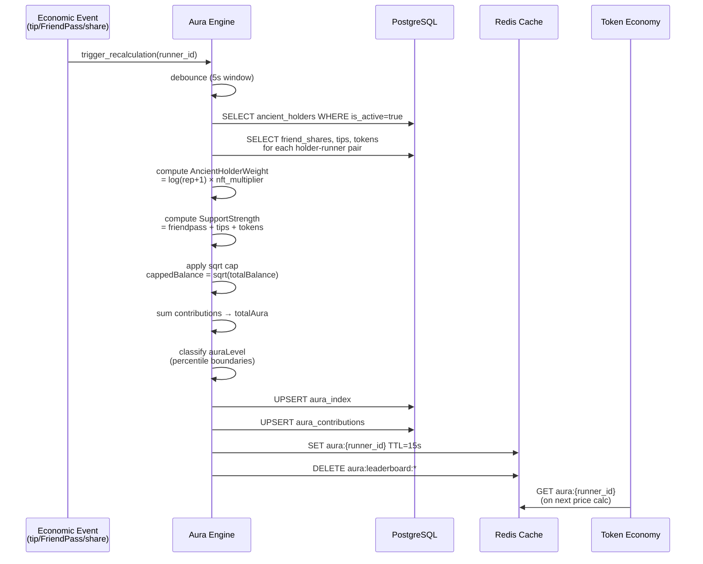

# Design Document: Ancient Aura System

## Overview

The Ancient Aura System introduces a protocol-level influence layer where Ancient NFT holders act as economic amplifiers for runners on the OnTrail platform. When an Ancient holder supports a runner (via tips, FriendPass purchases, or token participation), that runner accumulates an "Aura Score" that accelerates their bonding curve, boosts token allocations, amplifies reputation gains, and accelerates TGE progression.

The system is composed of four major subsystems:

1. **Ancient NFT Indexer** — A background poller that tracks Ancient NFT ownership on Base L2 by monitoring Transfer events and maintaining an `ancient_holders` table.
2. **Aura Engine** — The core calculation service (`aura_engine.py`) that computes per-runner aura scores using the formula `Σ (AncientHolderWeight × SupportStrength)` with sqrt whale caps and reputation weighting.
3. **Influence Graph** — A graph data model (`influence_nodes`, `influence_edges`) that models user-runner relationships for visualization and discovery.
4. **Aura API & Frontend** — REST endpoints for aura data/leaderboards and React components for aura visualization (glow effects, activity rings, graph navigation).

All aura logic runs off-chain in the FastAPI backend. Smart contracts receive pre-computed aura-adjusted parameters (effectiveSupply, effectiveTips, auraBoost) signed with EIP-712 typed data, enabling future on-chain verification without requiring on-chain aura computation.

### Key Design Decisions

- **Off-chain first**: Aura computation stays in FastAPI for rapid iteration. Contracts receive adjusted values via EIP-712 signed parameters.
- **Event-driven recalculation**: Aura recalculates on economic events (tips, FriendPass, shares, reputation changes, NFT transfers) rather than on a fixed schedule, with 5-second batching to deduplicate.
- **Sqrt whale cap**: `cappedBalance = sqrt(totalBalance)` limits whale dominance without eliminating large-holder influence.
- **Percentile-based levels**: Aura levels (Low/Rising/Strong/Dominant) use dynamic percentile boundaries recalculated every 5 minutes, adapting to the evolving distribution.
- **Numeric precision**: All financial/score fields use `Numeric`/`Decimal`, serialized as strings in JSON API responses, consistent with the existing token economy pattern.

## Architecture

```mermaid
graph TB
    subgraph "Base L2 Chain"
        ANC[Ancient NFT Contract]
        BC[BondingCurve Contract]
        TV[TipVault Contract]
    end

    subgraph "FastAPI Backend"
        IDX[Ancient NFT Indexer<br/>Background Task]
        AE[Aura Engine<br/>aura_engine.py]
        IG[Influence Graph<br/>Engine]
        TE[Token Economy<br/>token_economy.py]
        RE[Reputation Engine<br/>reputation_engine.py]
        AR[Aura Router<br/>/aura/*]
        GR[Graph Router<br/>/graph/*]
    end

    subgraph "Data Layer"
        PG[(PostgreSQL<br/>ancient_holders<br/>aura_index<br/>aura_contributions<br/>influence_nodes<br/>influence_edges)]
        RD[(Redis Cache<br/>aura:{runner_id}<br/>aura:percentiles<br/>aura:leaderboard:*<br/>graph:{username})]
    end

    subgraph "React Frontend"
        RP[Runner Profile<br/>Aura Display]
        LB[Aura Leaderboard]
        GV[Influence Graph<br/>Visualization]
        AR2[Activity Rings<br/>Aura Overlay]
    end

    ANC -->|Transfer events| IDX
    IDX -->|upsert holders| PG
    IDX -->|trigger recalc| AE

    AE -->|read holders, shares,<br/>tips, FriendPass| PG
    AE -->|cache aura| RD
    AE -->|write aura_index| PG

    TE -->|read aura for<br/>effectiveSupply| RD
    RE -->|read aura for<br/>auraFactor| RD

    AR -->|serve aura data| RP
    AR -->|serve leaderboards| LB
    GR -->|serve graph data| GV

    RP -->|fetch /aura/{id}| AR
    LB -->|fetch /aura/leaderboard/*| AR
    GV -->|fetch /graph/*| GR
```

### Data Flow: Aura Recalculation




## Components and Interfaces

### 1. Ancient NFT Indexer (`services/api/engines/ancient_indexer.py`)

A background async task that polls Base L2 for Ancient NFT Transfer events and maintains the `ancient_holders` table.

```python
class AncientNFTIndexer:
    """Polls Base L2 for Ancient NFT Transfer events."""

    def __init__(self, web3_client: ContractClient, db_session_factory, redis):
        ...

    async def start(self):
        """Main polling loop. Runs every 5-10 seconds."""
        ...

    async def get_last_processed_block(self) -> int:
        """Read last block from Redis key 'ancient_indexer:last_block'."""
        ...

    async def process_transfer_events(self, from_block: int, to_block: int):
        """Fetch Transfer events, upsert ancient_holders, trigger recalcs."""
        ...

    async def sync_full_state(self):
        """On startup: scan all current holders from contract."""
        ...
```

**Integration points:**
- Reads from: Base L2 RPC via `web3_client.py` `ContractClient`
- Writes to: `ancient_holders` table (upsert), Redis (`ancient_indexer:last_block`)
- Triggers: `AuraEngine.enqueue_recalculation()` when holder status changes

**Startup:** Registered as a FastAPI background task in `main.py` via `app.on_event("startup")`.

### 2. Aura Engine (`services/api/engines/aura_engine.py`)

The core calculation service. Computes aura scores, applies multipliers, and manages recalculation batching.

```python
# Configuration defaults (overridden by admin_config)
AURA_DEFAULTS = {
    "nft_multiplier": 1.0,
    "aura_boost_factor": 0.1,
    "max_aura_boost": 0.5,
    "max_aura_multiplier": 1.0,
    "max_aura_factor": 0.5,
    "ancient_multiplier": 1.2,
    "min_reputation_threshold": 1.0,
    "max_contribution_percentile": 95,
}

async def get_aura_config(db: AsyncSession) -> dict:
    """Read aura config from Redis (TTL 1hr) → DB → defaults."""
    ...

async def calculate_aura(db: AsyncSession, runner_id: UUID) -> AuraResult:
    """
    Core aura calculation for a single runner.
    Returns AuraResult with totalAura, weightedAura, ancientSupporterCount, auraLevel.

    Formula:
      For each active Ancient holder supporting this runner:
        holderWeight = log(reputation + 1) × nft_multiplier
        supportStrength = friendpass_count + tip_total + shares_held
        cappedBalance = sqrt(supportStrength)
        contribution = holderWeight × cappedBalance
      totalAura = Σ contributions (clamped >= 0)
    """
    ...

async def classify_aura_level(db: AsyncSession, total_aura: Decimal) -> str:
    """
    Classify into None/Low/Rising/Strong/Dominant using cached percentile boundaries.
    Boundaries recalculated at most every 5 minutes.
    """
    ...

async def enqueue_recalculation(runner_id: UUID):
    """
    Add runner_id to recalculation queue.
    Batches within 5-second windows to deduplicate.
    """
    ...

async def process_recalculation_batch():
    """Process queued runner recalculations in batches of 50."""
    ...

# --- Multiplier functions used by other engines ---

async def get_effective_supply(db: AsyncSession, runner_id: UUID, actual_supply: int) -> int:
    """
    effectiveSupply = supply - (auraBoostFactor × totalAura)
    Clamped to [supply * 0.5, supply]. Returns actual_supply if aura is 0.
    """
    ...

async def get_effective_tips(db: AsyncSession, runner_id: UUID, raw_tips: Decimal) -> Decimal:
    """
    effectiveTips = rawTips × (1 + auraMultiplier)
    auraMultiplier capped at max_aura_multiplier (default 1.0).
    """
    ...

async def get_aura_boost(db: AsyncSession, runner_id: UUID) -> Decimal:
    """
    auraBoost for token allocation: capped at max_aura_boost (default 0.5).
    """
    ...

async def get_reputation_aura_factor(db: AsyncSession, runner_id: UUID) -> Decimal:
    """
    auraFactor for reputation gain amplification.
    Capped at max_aura_factor (default 0.5).
    """
    ...
```

### 3. Influence Graph Engine (`services/api/engines/influence_engine.py`)

Manages the influence graph data model and score calculations.

```python
async def calculate_influence(db: AsyncSession, user_id: UUID) -> Decimal:
    """
    influence = Σ incoming_edge_weights × auraMultiplier
    Ancient holders get additional 1.25× multiplier.
    Per-edge contribution capped via admin_config.
    """
    ...

async def upsert_edge(db: AsyncSession, from_user_id: UUID, to_runner_id: UUID,
                       edge_type: str, weight: Decimal):
    """Upsert an influence edge. edge_type: friendpass|tip|token|referral."""
    ...

async def get_node_with_neighbors(db: AsyncSession, user_id: UUID, max_neighbors: int = 20) -> dict:
    """Return node info + immediate neighbors for graph visualization."""
    ...

async def get_trending(db: AsyncSession) -> dict:
    """Top aura growth and influence gain for discovery."""
    ...

async def decay_inactive_edges(db: AsyncSession, decay_factor: float = 0.95):
    """Periodic task: reduce weight of edges with no recent activity."""
    ...

async def detect_circular_loops(db: AsyncSession, user_id: UUID) -> list:
    """Detect circular support loops and reduce their weight."""
    ...
```

### 4. Aura Router (`services/api/routers/aura.py`)

New FastAPI router registered at `/aura` prefix.

```python
router = APIRouter()

@router.get("/{runner_id}")
async def get_runner_aura(runner_id: str, db: AsyncSession = Depends(get_db)):
    """
    Returns: totalAura, auraLevel, ancientSupporterCount, weightedAura,
    and list of Ancient supporters with individual contributions.
    Serves from Redis cache, falls back to DB.
    """
    ...

@router.get("/leaderboard/runners")
async def get_runner_leaderboard(db: AsyncSession = Depends(get_db)):
    """Top 100 runners by totalAura. Cached 60s in Redis."""
    ...

@router.get("/leaderboard/ancients")
async def get_ancient_leaderboard(db: AsyncSession = Depends(get_db)):
    """Top 100 Ancient holders by total influence. Cached 60s in Redis."""
    ...
```

### 5. Graph Router (`services/api/routers/graph.py`)

New FastAPI router registered at `/graph` prefix.

```python
router = APIRouter()

@router.get("/node/{username}")
async def get_graph_node(username: str, db: AsyncSession = Depends(get_db)):
    """Node info + max 20 neighbors. Cached 15s. Max 200KB response."""
    ...

@router.get("/neighbors/{username}")
async def get_neighbors(username: str, db: AsyncSession = Depends(get_db)):
    """Connected nodes with edge weights. Paginated."""
    ...

@router.get("/trending")
async def get_trending(db: AsyncSession = Depends(get_db)):
    """Top aura growth + influence gain. Prioritizes recent growth."""
    ...
```

### 6. Integration with Existing Engines

**Token Economy (`token_economy.py`) modifications:**
- `bonding_curve_price()` accepts optional `effective_supply` override from `AuraEngine.get_effective_supply()`
- `buy_shares()` applies `auraBoost` to token allocation: `allocated = amount × (1 + auraBoost)`
- `check_tge_threshold()` compares `effectiveTips` (from `AuraEngine.get_effective_tips()`) against threshold

**Reputation Engine (`reputation_engine.py`) modifications:**
- `record_reputation_event()` multiplies weight by `(1 + auraFactor)` when runner has non-zero aura
- `calculate_reputation()` applies `ancientMultiplier` (default 1.2) for runners who are also Ancient holders
- After reputation update, calls `AuraEngine.enqueue_recalculation()` for affected runners

### 7. Frontend Components

**AuraIndicator** (`apps/web/src/components/AuraIndicator.tsx`):
- Renders aura level badge with color mapping (gray/blue/purple/gold)
- Shows Ancient supporter count
- Renders glow/ring effect for Strong/Dominant levels
- Displays boost feedback toast on tip/FriendPass actions

**AuraLeaderboard** (`apps/web/src/pages/AuraLeaderboard.tsx`):
- Tabbed view: "Top Aura Runners" / "Most Influential Ancients"
- Fetches from `/aura/leaderboard/runners` and `/aura/leaderboard/ancients`
- Click-through to runner profiles or wallet summaries

**InfluenceGraph** (`apps/web/src/components/InfluenceGraph.tsx`):
- Force-directed graph visualization (using a library like `react-force-graph` or `d3-force`)
- Node size ∝ reputation, glow intensity ∝ aura
- Edge thickness ∝ weight, pulse animation for recent activity
- Zoom/pan, max 50 visible nodes, lazy-load on demand
- Tap node → center + load neighbors

**AuraRings** (`apps/web/src/components/AuraRings.tsx`):
- Overlay behind activity rings on runner profile
- Animated gradient based on aura level (faint → flowing → shimmering)
- Low opacity (<30%), slow wave motion, targets 30-60 FPS

### 8. EIP-712 Signing for On-Chain Parameters

When the backend passes aura-adjusted parameters to smart contracts:

```python
# EIP-712 typed data structure for aura parameters
AURA_PARAMS_TYPE = {
    "AuraParams": [
        {"name": "runnerId", "type": "address"},
        {"name": "effectiveSupply", "type": "uint256"},
        {"name": "auraBoost", "type": "uint256"},
        {"name": "effectiveTips", "type": "uint256"},
        {"name": "timestamp", "type": "uint256"},
    ]
}
```

The backend signs these parameters with the platform's private key. Contracts can verify the signature on-chain, enabling a future migration path where contracts validate aura adjustments without computing them.


## Data Models

### New Database Tables

#### `ancient_holders`

Tracks wallets holding Ancient NFTs on Base L2.

| Column | Type | Constraints | Description |
|--------|------|-------------|-------------|
| `id` | UUID | PK, default uuid4 | Primary key |
| `wallet_address` | String(42) | UNIQUE, INDEXED, NOT NULL | Ethereum wallet address |
| `token_count` | Integer | NOT NULL, default 0 | Number of Ancient NFTs held |
| `is_active` | Boolean | NOT NULL, default true | False when token_count drops to 0 |
| `last_synced_at` | DateTime | NOT NULL | Last time this record was synced from chain |
| `created_at` | DateTime | NOT NULL, default utcnow | Record creation time |

```python
class AncientHolder(Base):
    __tablename__ = "ancient_holders"
    id = Column(UUID(as_uuid=True), primary_key=True, default=gen_uuid)
    wallet_address = Column(String(42), unique=True, nullable=False, index=True)
    token_count = Column(Integer, nullable=False, default=0)
    is_active = Column(Boolean, nullable=False, default=True)
    last_synced_at = Column(DateTime, nullable=False, default=datetime.utcnow)
    created_at = Column(DateTime, nullable=False, default=datetime.utcnow)
```

#### `aura_index`

Per-runner aura score cache in the database.

| Column | Type | Constraints | Description |
|--------|------|-------------|-------------|
| `id` | UUID | PK, default uuid4 | Primary key |
| `runner_id` | UUID | FK→users.id, UNIQUE, INDEXED | The runner this aura belongs to |
| `total_aura` | Numeric | NOT NULL, default 0 | Aggregate aura score |
| `weighted_aura` | Numeric | NOT NULL, default 0 | Reputation-weighted aura |
| `ancient_supporter_count` | Integer | NOT NULL, default 0 | Number of active Ancient supporters |
| `aura_level` | String(20) | NOT NULL, default "None" | None/Low/Rising/Strong/Dominant |
| `updated_at` | DateTime | NOT NULL, onupdate utcnow | Last recalculation time |
| `created_at` | DateTime | NOT NULL, default utcnow | Record creation time |

```python
class AuraIndex(Base):
    __tablename__ = "aura_index"
    id = Column(UUID(as_uuid=True), primary_key=True, default=gen_uuid)
    runner_id = Column(UUID(as_uuid=True), ForeignKey("users.id"), unique=True, nullable=False, index=True)
    total_aura = Column(Numeric, nullable=False, default=0)
    weighted_aura = Column(Numeric, nullable=False, default=0)
    ancient_supporter_count = Column(Integer, nullable=False, default=0)
    aura_level = Column(String(20), nullable=False, default="None")
    updated_at = Column(DateTime, nullable=False, default=datetime.utcnow, onupdate=datetime.utcnow)
    created_at = Column(DateTime, nullable=False, default=datetime.utcnow)
```

#### `aura_contributions`

Per-holder-per-runner contribution breakdown.

| Column | Type | Constraints | Description |
|--------|------|-------------|-------------|
| `id` | UUID | PK, default uuid4 | Primary key |
| `ancient_holder_id` | UUID | FK→ancient_holders.id, NOT NULL | The Ancient holder |
| `runner_id` | UUID | FK→users.id, NOT NULL | The runner being supported |
| `holder_weight` | Numeric | NOT NULL | log(rep+1) × nft_multiplier |
| `support_strength` | Numeric | NOT NULL | Aggregated support metric |
| `contribution` | Numeric | NOT NULL | Final contribution after sqrt cap |
| `updated_at` | DateTime | NOT NULL, onupdate utcnow | Last update time |

Composite unique index on `(ancient_holder_id, runner_id)`.

```python
class AuraContribution(Base):
    __tablename__ = "aura_contributions"
    id = Column(UUID(as_uuid=True), primary_key=True, default=gen_uuid)
    ancient_holder_id = Column(UUID(as_uuid=True), ForeignKey("ancient_holders.id"), nullable=False)
    runner_id = Column(UUID(as_uuid=True), ForeignKey("users.id"), nullable=False)
    holder_weight = Column(Numeric, nullable=False)
    support_strength = Column(Numeric, nullable=False)
    contribution = Column(Numeric, nullable=False)
    updated_at = Column(DateTime, nullable=False, default=datetime.utcnow, onupdate=datetime.utcnow)

    __table_args__ = (
        Index("ix_aura_contributions_holder_runner", "ancient_holder_id", "runner_id", unique=True),
    )
```

#### `influence_nodes`

Graph nodes representing users in the influence network.

| Column | Type | Constraints | Description |
|--------|------|-------------|-------------|
| `id` | UUID | PK, default uuid4 | Primary key |
| `user_id` | UUID | FK→users.id, UNIQUE, INDEXED | The user this node represents |
| `reputation_score` | Numeric | NOT NULL, default 0 | Cached reputation score |
| `aura_score` | Numeric | NOT NULL, default 0 | Cached aura score |
| `is_ancient` | Boolean | NOT NULL, default false | Whether user holds Ancient NFT |
| `created_at` | DateTime | NOT NULL, default utcnow | Record creation time |

```python
class InfluenceNode(Base):
    __tablename__ = "influence_nodes"
    id = Column(UUID(as_uuid=True), primary_key=True, default=gen_uuid)
    user_id = Column(UUID(as_uuid=True), ForeignKey("users.id"), unique=True, nullable=False, index=True)
    reputation_score = Column(Numeric, nullable=False, default=0)
    aura_score = Column(Numeric, nullable=False, default=0)
    is_ancient = Column(Boolean, nullable=False, default=False)
    created_at = Column(DateTime, nullable=False, default=datetime.utcnow)
```

#### `influence_edges`

Directed edges representing support relationships.

| Column | Type | Constraints | Description |
|--------|------|-------------|-------------|
| `id` | UUID | PK, default uuid4 | Primary key |
| `from_user_id` | UUID | FK→users.id, NOT NULL | Supporter |
| `to_runner_id` | UUID | FK→users.id, NOT NULL | Runner being supported |
| `edge_type` | String(20) | NOT NULL | friendpass, tip, token, referral |
| `weight` | Numeric | NOT NULL, default 0 | Edge weight (financial participation) |
| `updated_at` | DateTime | NOT NULL, onupdate utcnow | Last update time |

Composite index on `(from_user_id, to_runner_id)`.

```python
class InfluenceEdge(Base):
    __tablename__ = "influence_edges"
    id = Column(UUID(as_uuid=True), primary_key=True, default=gen_uuid)
    from_user_id = Column(UUID(as_uuid=True), ForeignKey("users.id"), nullable=False)
    to_runner_id = Column(UUID(as_uuid=True), ForeignKey("users.id"), nullable=False)
    edge_type = Column(String(20), nullable=False)
    weight = Column(Numeric, nullable=False, default=0)
    updated_at = Column(DateTime, nullable=False, default=datetime.utcnow, onupdate=datetime.utcnow)

    __table_args__ = (
        Index("ix_influence_edges_from_to", "from_user_id", "to_runner_id"),
    )
```

### Redis Cache Keys

| Key Pattern | TTL | Description |
|-------------|-----|-------------|
| `aura:{runner_id}` | 15s | Cached AuraIndex JSON for a runner |
| `aura:percentiles` | 300s (5min) | Percentile boundary values for level classification |
| `aura:leaderboard:runners` | 60s | Top 100 runners leaderboard |
| `aura:leaderboard:ancients` | 60s | Top 100 Ancient holders leaderboard |
| `aura:config` | 3600s (1hr) | Aura configuration from admin_config |
| `aura:recalc_queue` | — | Redis Set of runner_ids pending recalculation |
| `ancient_indexer:last_block` | — | Last processed block number (persistent) |
| `graph:{username}` | 15s | Cached graph node + neighbors |
| `graph:trending` | 60s | Trending runners/influence data |

### Admin Config Keys

| Key | Default | Description |
|-----|---------|-------------|
| `nft_multiplier` | 1.0 | Multiplier per Ancient NFT in holder weight |
| `aura_boost_factor` | 0.1 | Scaling constant for bonding curve supply reduction |
| `max_aura_boost` | 0.5 | Cap on token allocation boost (50% max bonus) |
| `max_aura_multiplier` | 1.0 | Cap on TGE tip effectiveness multiplier (2× max) |
| `max_aura_factor` | 0.5 | Cap on reputation gain amplification |
| `ancient_multiplier` | 1.2 | Reputation multiplier for Ancient holders |
| `min_reputation_threshold` | 1.0 | Minimum reputation to contribute aura |
| `max_contribution_percentile` | 95 | Per-holder contribution cap percentile |

