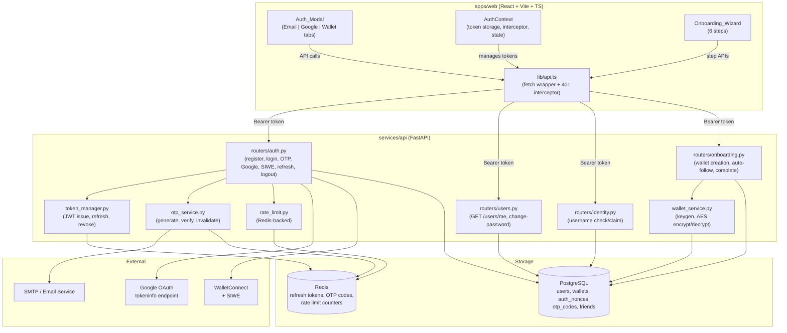
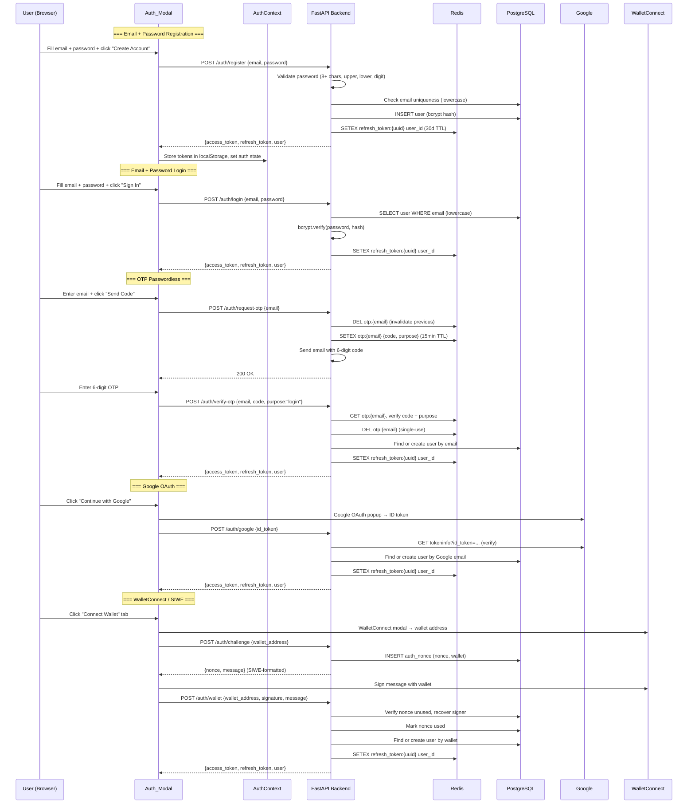
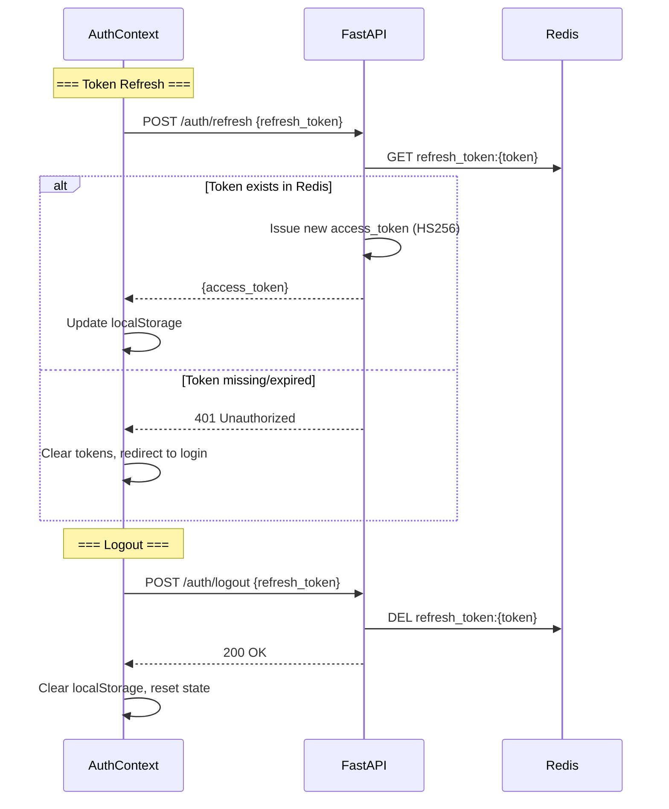
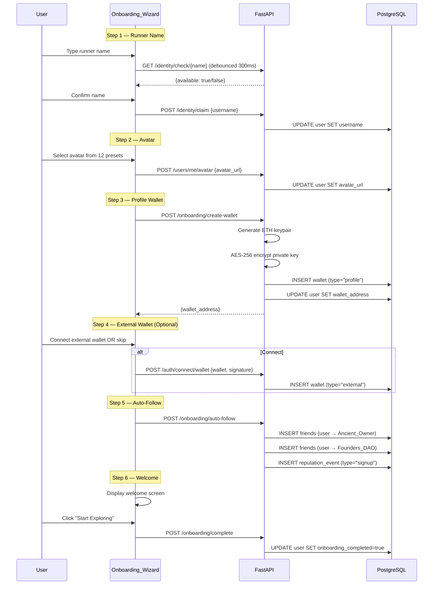

# Design Document: Auth + Onboarding System

## Overview

This design replaces the current Privy-based authentication in OnTrail with a fully self-hosted auth system. The system provides five authentication methods (email+password, OTP passwordless, forgot-password OTP, Google OAuth, WalletConnect/SIWE), a JWT token system with Redis-backed refresh token revocation, and a 6-step onboarding wizard for new users.

The backend is implemented in FastAPI (Python) with PostgreSQL (SQLAlchemy async) and Redis (aioredis). The frontend is React + Vite + TypeScript. The existing `services/api/routers/auth.py` (wallet-only auth) is fully rewritten, and `apps/web/src/context/AuthContext.tsx` (Privy-based) is fully replaced. All `@privy-io/react-auth` imports and the `PrivyProvider` wrapper in `main.tsx` are removed.

### Key Design Decisions

1. **HS256 JWT with Redis refresh tokens** — Access tokens are stateless HS256 JWTs (30-day TTL per requirements). Refresh tokens are opaque UUIDs stored in Redis, enabling instant revocation via `DELETE` without token blacklists.
2. **Unified auth response** — All five auth methods return the same `{access_token, refresh_token, user}` shape, simplifying the frontend AuthContext.
3. **Server-side profile wallets** — New users get an auto-generated Ethereum wallet with AES-256-encrypted private key stored in the `wallets` table, removing the need for Privy embedded wallets.
4. **Anti-enumeration by design** — Login and forgot-password endpoints return identical error messages/status codes regardless of whether the email exists.
5. **OTP stored in Redis** — OTP codes use Redis with 15-minute TTL rather than a database table, keeping the OTP lifecycle ephemeral and fast.
6. **Rate limiting via existing Redis infrastructure** — Extends the existing `rate_limit.py` pattern with per-IP and per-email limits on auth endpoints.

## Architecture

### High-Level Architecture Diagram



### Authentication Flow — All 5 Methods



### Token Refresh & Logout Flow



### Onboarding Wizard Flow



## Components and Interfaces

### Backend Components

#### 1. Auth Router (`services/api/routers/auth.py`) — Full Rewrite

```python
# Endpoints (all return AuthResponse):
POST /auth/register          # Email + password registration
POST /auth/login             # Email + password login
POST /auth/request-otp       # Request OTP (login or forgot-password)
POST /auth/verify-otp        # Verify OTP (login, reset, or auto-register)
POST /auth/forgot-password   # Request password reset OTP (anti-enumeration: always 200)
POST /auth/google            # Google OAuth ID token verification
POST /auth/challenge         # SIWE challenge generation
POST /auth/wallet            # SIWE signature verification + login
POST /auth/refresh           # Refresh access token
POST /auth/logout            # Revoke refresh token
POST /auth/connect/wallet    # Link external wallet to existing account
```

#### 2. Token Manager (`services/api/token_manager.py`)

```python
class TokenManager:
    async def create_access_token(user_id: str, email: str, role: str, wallet: str) -> str
        """HS256 JWT with {sub, email, role, wallet_address, exp}. 30-day TTL."""

    async def create_refresh_token(user_id: str) -> str
        """Generate UUID, store in Redis as refresh_token:{uuid} → user_id. 30-day TTL."""

    async def verify_refresh_token(token: str) -> str | None
        """GET refresh_token:{token} from Redis. Returns user_id or None."""

    async def revoke_refresh_token(token: str) -> None
        """DEL refresh_token:{token} from Redis."""

    async def revoke_all_user_tokens(user_id: str) -> None
        """SCAN + DEL all refresh_token:* matching user_id."""
```

#### 3. OTP Service (`services/api/otp_service.py`)

```python
class OTPService:
    async def generate_otp(email: str, purpose: str = "login") -> str
        """Generate 6-digit code, DEL previous, SETEX otp:{email} with 15min TTL.
           Returns the code (caller sends via email)."""

    async def verify_otp(email: str, code: str, purpose: str = "login") -> bool
        """GET otp:{email}, compare code + purpose. DEL on success (single-use).
           Returns True/False."""
```

#### 4. Wallet Service (`services/api/wallet_service.py`)

```python
class WalletService:
    def generate_wallet() -> tuple[str, str]
        """Generate ETH keypair. Returns (address, private_key_hex)."""

    def encrypt_private_key(key_hex: str) -> str
        """AES-256-GCM encrypt using WALLET_ENCRYPTION_KEY env var. Returns base64."""

    def decrypt_private_key(encrypted: str) -> str
        """AES-256-GCM decrypt. Returns hex private key."""
```

#### 5. Updated Users Router (`services/api/routers/users.py`)

```python
# New/modified endpoints:
GET  /users/me                  # Authenticated user profile (id, username, email, wallet, avatar, reputation, roles, onboarding_completed)
POST /users/me/avatar           # Update avatar URL
POST /users/me/change-password  # Change password (verify current, set new)
```

#### 6. Updated Onboarding Router (`services/api/routers/onboarding.py`)

```python
# New endpoints (replaces Privy-based register):
POST /onboarding/create-wallet   # Generate profile wallet for user
POST /onboarding/auto-follow     # Create follow relationships (Ancient_Owner, Founders_DAO)
POST /onboarding/complete        # Mark onboarding as complete
```

### Frontend Components

#### 1. Auth_Modal (`apps/web/src/components/AuthModal.tsx`)

```typescript
interface AuthModalProps {
  isOpen: boolean;
  onClose: () => void;
  onSuccess: (user: AuthUser) => void;
  defaultTab?: 'email' | 'google' | 'wallet';
}

// Internal state machine:
// tab: 'email' | 'google' | 'wallet'
// emailMode: 'login' | 'register' | 'otp' | 'forgot-password' | 'reset-password'
// Sub-components: EmailForm, OTPInput, GoogleButton, WalletConnectButton
```

Visual design:
- Centered overlay with `backdrop-blur-xl bg-black/50`
- Card: `bg-white rounded-2xl shadow-2xl max-w-md`
- Tabs: emerald/green active indicator (`bg-emerald-500 text-white`)
- Inputs: `rounded-xl border-gray-200 focus:ring-emerald-500`
- Buttons: `bg-gradient-to-r from-green-500 to-emerald-500 rounded-xl`
- Transitions: `framer-motion` `AnimatePresence` for tab/mode switches

#### 2. OTPInput (`apps/web/src/components/OTPInput.tsx`)

```typescript
interface OTPInputProps {
  length?: number;        // default 6
  onComplete: (code: string) => void;
  disabled?: boolean;
  error?: string;
}

// 6 individual digit inputs with:
// - Auto-focus advancement on digit entry
// - Backspace moves to previous input
// - Paste support (splits pasted string across inputs)
// - aria-label per digit for accessibility
```

#### 3. Onboarding_Wizard (`apps/web/src/components/OnboardingWizard.tsx`)

```typescript
interface OnboardingWizardProps {
  user: AuthUser;
  onComplete: () => void;
}

// Steps (linear, no skip except step 4):
// 1. RunnerNameStep — text input + debounced availability check
// 2. AvatarStep — 12 preset avatars in grid
// 3. ProfileWalletStep — auto-generate, display address
// 4. ExternalWalletStep — ConnectKit button OR "Skip" button
// 5. AutoFollowStep — automatic, shows progress
// 6. WelcomeStep — summary + CTA button
```

#### 4. AuthContext (`apps/web/src/context/AuthContext.tsx`) — Full Replacement

```typescript
interface AuthState {
  isConnected: boolean;
  isLoading: boolean;
  wallet: string | null;
  userId: string | null;
  username: string | null;
  email: string | null;
  roles: string[];
  isAdmin: boolean;
  isAncientOwner: boolean;
  avatarUrl: string | null;
  onboardingCompleted: boolean;
  login: () => void;          // Opens Auth_Modal
  logout: () => void;         // POST /auth/logout + clear state
  loginWithWallet: () => void; // Opens Auth_Modal on wallet tab
}

// Initialization:
// 1. Check localStorage for access_token
// 2. If exists, GET /users/me to hydrate state
// 3. If 401, attempt refresh via stored refresh_token
// 4. If refresh fails, clear tokens and set isConnected=false

// HTTP Interceptor (in lib/api.ts):
// - Attach Bearer token to all requests
// - On 401: attempt refresh, retry original request
// - On refresh failure: logout
```

#### 5. Updated `lib/api.ts`

```typescript
// New auth API methods:
api.authRegister(email, password)           // POST /auth/register
api.authLogin(email, password)              // POST /auth/login
api.authRequestOTP(email)                   // POST /auth/request-otp
api.authVerifyOTP(email, code, purpose?)    // POST /auth/verify-otp
api.authForgotPassword(email)               // POST /auth/forgot-password
api.authGoogle(idToken)                     // POST /auth/google
api.authChallenge(walletAddress)            // POST /auth/challenge
api.authWallet(walletAddress, sig, msg)     // POST /auth/wallet
api.authRefresh(refreshToken)               // POST /auth/refresh
api.authLogout(refreshToken)                // POST /auth/logout
api.authConnectWallet(wallet, sig, msg)     // POST /auth/connect/wallet
api.getMe()                                 // GET /users/me
api.updateAvatar(avatarUrl)                 // POST /users/me/avatar
api.changePassword(current, newPw)          // POST /users/me/change-password
api.createProfileWallet()                   // POST /onboarding/create-wallet
api.autoFollow()                            // POST /onboarding/auto-follow
api.completeOnboarding()                    // POST /onboarding/complete
```

## Data Models

### New/Modified Database Tables

#### User Table — Modified (`services/api/models.py`)

```python
class User(Base):
    __tablename__ = "users"
    id = Column(UUID(as_uuid=True), primary_key=True, default=gen_uuid)
    username = Column(String(20), unique=True, nullable=True, index=True)  # nullable until onboarding
    email = Column(String(255), unique=True, nullable=True, index=True)    # unique constraint added
    password_hash = Column(String(255), nullable=True)                     # NEW: bcrypt hash (null for OAuth/wallet-only)
    wallet_address = Column(String(42), unique=True, nullable=True, index=True)  # nullable (email-only users)
    avatar_url = Column(String(500), nullable=True)                        # NEW
    google_id = Column(String(255), unique=True, nullable=True)            # NEW: Google OAuth sub
    onboarding_completed = Column(Boolean, default=False)                  # NEW
    reputation_score = Column(Float, default=0.0)
    created_at = Column(DateTime, default=datetime.utcnow)
    updated_at = Column(DateTime, default=datetime.utcnow, onupdate=datetime.utcnow)
```

#### Wallet Table — Modified

```python
class Wallet(Base):
    __tablename__ = "wallets"
    id = Column(UUID(as_uuid=True), primary_key=True, default=gen_uuid)
    user_id = Column(UUID(as_uuid=True), ForeignKey("users.id"), nullable=False)
    wallet_address = Column(String(42), nullable=False, unique=True)       # unique constraint added
    wallet_type = Column(String(50), default="profile")                    # "profile" | "external"
    encrypted_private_key = Column(Text, nullable=True)                    # NEW: AES-256 encrypted (profile wallets only)
    created_at = Column(DateTime, default=datetime.utcnow)
```

#### AuthNonce Table — Unchanged

Existing `auth_nonces` table is reused for SIWE challenge nonces. No changes needed.

### Redis Data Structures

```
# Refresh tokens (30-day TTL)
refresh_token:{uuid}  →  user_id    SETEX 2592000

# OTP codes (15-minute TTL)
otp:{email}  →  JSON{"code": "123456", "purpose": "login"|"reset"}    SETEX 900

# Rate limit counters (per existing pattern)
rl:auth:{ip}           →  count    EXPIRE 60    (5 req/min)
rl:otp:{email}         →  count    EXPIRE 60    (3 req/min)
rl:register:{ip}       →  count    EXPIRE 60    (5 req/min)
```

### API Request/Response Schemas

```python
# === Auth Responses (unified) ===
class AuthResponse(BaseModel):
    access_token: str
    refresh_token: str
    token_type: str = "bearer"
    user: UserData

class UserData(BaseModel):
    id: str
    username: str | None
    email: str | None
    wallet_address: str | None
    avatar_url: str | None
    reputation_score: float
    roles: list[str]
    onboarding_completed: bool

# === Registration ===
class RegisterRequest(BaseModel):
    email: str          # EmailStr validated
    password: str       # min 8, upper, lower, digit

# === Login ===
class LoginRequest(BaseModel):
    email: str
    password: str

# === OTP ===
class RequestOTPRequest(BaseModel):
    email: str

class VerifyOTPRequest(BaseModel):
    email: str
    code: str           # 6 digits
    purpose: str = "login"   # "login" | "reset"
    new_password: str | None = None  # required when purpose="reset"

# === Google OAuth ===
class GoogleAuthRequest(BaseModel):
    id_token: str

# === SIWE ===
class ChallengeRequest(BaseModel):
    wallet_address: str

class ChallengeResponse(BaseModel):
    nonce: str
    message: str

class WalletAuthRequest(BaseModel):
    wallet_address: str
    signature: str
    message: str

# === Token Refresh ===
class RefreshRequest(BaseModel):
    refresh_token: str

class RefreshResponse(BaseModel):
    access_token: str

# === Logout ===
class LogoutRequest(BaseModel):
    refresh_token: str

# === Change Password ===
class ChangePasswordRequest(BaseModel):
    current_password: str
    new_password: str

# === Profile Wallet ===
class CreateWalletResponse(BaseModel):
    wallet_address: str

# === Connect External Wallet ===
class ConnectWalletRequest(BaseModel):
    wallet_address: str
    signature: str
    message: str

# === User Profile (GET /users/me) ===
class MeResponse(BaseModel):
    id: str
    username: str | None
    email: str | None
    wallet_address: str | None
    avatar_url: str | None
    reputation_score: float
    roles: list[str]
    onboarding_completed: bool
```

### JWT Access Token Payload

```json
{
  "sub": "uuid-user-id",
  "email": "user@example.com",
  "role": "user",
  "wallet_address": "0x...",
  "exp": 1234567890,
  "iat": 1234567890
}
```

### New Config Settings (`services/api/config.py`)

```python
# Added to Settings class:
google_client_id: str = ""                          # Google OAuth client ID
smtp_host: str = "localhost"                         # Email sending
smtp_port: int = 587
smtp_user: str = ""
smtp_password: str = ""
smtp_from: str = "noreply@ontrail.tech"
wallet_encryption_key: str = "change-me-32-bytes"   # AES-256 key (32 bytes hex)
siwe_domain: str = "ontrail.tech"                   # SIWE message domain
```

### Alembic Migration

A single migration adds the new columns and constraints:

```python
# New columns on users:
# - password_hash (String 255, nullable)
# - avatar_url (String 500, nullable)
# - google_id (String 255, unique, nullable)
# - onboarding_completed (Boolean, default False)
# - email gets UNIQUE constraint
# - wallet_address becomes nullable
# - username becomes nullable

# New column on wallets:
# - encrypted_private_key (Text, nullable)
# - wallet_address gets UNIQUE constraint
```


## Correctness Properties

*A property is a characteristic or behavior that should hold true across all valid executions of a system — essentially, a formal statement about what the system should do. Properties serve as the bridge between human-readable specifications and machine-verifiable correctness guarantees.*

### Property 1: Registration → Login Round-Trip

*For any* valid email and valid password, registering via `POST /auth/register` and then logging in via `POST /auth/login` with the same credentials should return valid JWT tokens, and decoding the access token should yield the same user ID in both responses.

**Validates: Requirements 1.1, 2.1**

### Property 2: Duplicate Email Rejection

*For any* email address, registering twice with the same email (case-insensitive) should succeed the first time and return a 409 Conflict error with "Email already registered" the second time.

**Validates: Requirements 1.2**

### Property 3: Password Validation

*For any* string, the password validator should accept it if and only if it has at least 8 characters, at least one uppercase letter, at least one lowercase letter, and at least one digit. Invalid passwords should be rejected with a 422 status on registration, reset, and change-password flows.

**Validates: Requirements 1.3, 1.4, 4.4, 18.3**

### Property 4: Email Case Normalization

*For any* email string with mixed casing, after registration the stored email should be the lowercase version. Registering with `"User@Example.COM"` and then calling `GET /users/me` should return `"user@example.com"`.

**Validates: Requirements 1.5**

### Property 5: Login Anti-Enumeration

*For any* login attempt, whether the email does not exist in the database or the password is incorrect, the response should be identical: 401 status with the message "Invalid credentials". The response body and status code must be indistinguishable between the two cases.

**Validates: Requirements 2.2, 2.3**

### Property 6: OTP Format

*For any* email submitted to `POST /auth/request-otp`, the generated OTP code stored in Redis should be exactly 6 numeric digits (matching the regex `^\d{6}$`).

**Validates: Requirements 3.1**

### Property 7: OTP Invalidation on Re-Request

*For any* email, if an OTP is requested, then a second OTP is requested for the same email, verifying the first OTP should fail with 401, and only the second OTP should be valid.

**Validates: Requirements 3.2**

### Property 8: OTP Auto-Registration

*For any* email that does not have an existing user account, requesting an OTP and then verifying it should auto-create a new user record and return valid tokens. For any email that does have an existing account, verifying the OTP should return tokens for the existing user (same user ID).

**Validates: Requirements 3.3, 3.4**

### Property 9: OTP Single-Use

*For any* valid OTP, after successful verification the same code should be rejected on a second verification attempt with 401 "Invalid or expired OTP". Additionally, any incorrect code should be rejected.

**Validates: Requirements 3.5, 3.6**

### Property 10: Forgot-Password Anti-Enumeration

*For any* email address (whether it exists in the database or not), `POST /auth/forgot-password` should always return HTTP 200 OK. The response should be identical regardless of email existence.

**Validates: Requirements 4.1**

### Property 11: Password Reset Round-Trip

*For any* registered user with a password, after requesting a forgot-password OTP, verifying it with `purpose="reset"` and a new valid password, logging in with the new password should succeed and logging in with the old password should fail with 401.

**Validates: Requirements 4.3**

### Property 12: SIWE Challenge Format

*For any* Ethereum wallet address, `POST /auth/challenge` should return a message containing the domain `ontrail.tech`, a unique nonce, and a human-readable statement. The nonce should be stored in the `auth_nonces` table with `used=false`.

**Validates: Requirements 6.1**

### Property 13: SIWE Auth Round-Trip

*For any* Ethereum keypair, requesting a challenge, signing the message with the private key, and submitting the signature to `POST /auth/wallet` should return valid tokens. If the wallet is new, a user record should be created. If the wallet already exists, the same user ID should be returned.

**Validates: Requirements 6.2, 6.3, 6.4**

### Property 14: SIWE Invalid Signature Rejection

*For any* wallet address and any signature that was not produced by the corresponding private key, `POST /auth/wallet` should return 401 with "Invalid signature".

**Validates: Requirements 6.5**

### Property 15: SIWE Nonce Replay Prevention

*For any* completed SIWE authentication, resubmitting the same nonce and signature a second time should fail with 401, because the nonce is marked as used.

**Validates: Requirements 6.6**

### Property 16: JWT Payload Correctness

*For any* user who authenticates via any method, the issued JWT access token should decode (using HS256 and the configured secret) to a payload containing `sub` (matching the user ID), `email`, `role`, and `wallet_address` fields, with an `exp` claim set approximately 30 days in the future.

**Validates: Requirements 7.1**

### Property 17: Refresh Token Redis Storage

*For any* successful authentication, the returned refresh token should exist as a key in Redis (`refresh_token:{token}`) with the value being the user ID.

**Validates: Requirements 7.2**

### Property 18: Token Refresh Round-Trip

*For any* valid refresh token stored in Redis, `POST /auth/refresh` should return a new valid access token that decodes to the same user ID.

**Validates: Requirements 7.3**

### Property 19: Logout Revokes Refresh Token

*For any* valid refresh token, after calling `POST /auth/logout`, the refresh token should no longer exist in Redis, and subsequent calls to `POST /auth/refresh` with that token should return 401.

**Validates: Requirements 7.4, 7.5**

### Property 20: HTTP Interceptor Token Attachment and Refresh

*For any* authenticated state with tokens in localStorage, every API request should include the `Authorization: Bearer {access_token}` header. When a request returns 401, the interceptor should attempt a refresh using the stored refresh token. If refresh succeeds, the original request should be retried. If refresh fails, tokens should be cleared and the user logged out.

**Validates: Requirements 7.6, 7.7, 15.3**

### Property 21: Runner Name Validation

*For any* string, the runner name validator should accept it if and only if it is 3-20 characters long, contains only alphanumeric characters and underscores, and is not a reserved word. Validation should be case-insensitive (e.g., "Admin" is rejected).

**Validates: Requirements 8.3**

### Property 22: Runner Name Claim Persistence

*For any* valid and available runner name, after claiming via `POST /identity/claim`, `GET /users/me` should return that username, and `GET /identity/check/{username}` should report it as taken.

**Validates: Requirements 8.5**

### Property 23: Avatar Save Round-Trip

*For any* avatar URL, after saving via `POST /users/me/avatar`, `GET /users/me` should return the same `avatar_url`.

**Validates: Requirements 9.3**

### Property 24: Profile Wallet Creation Round-Trip

*For any* user, calling `POST /onboarding/create-wallet` should return a valid Ethereum address (matching `^0x[0-9a-fA-F]{40}$`). The `wallets` table should contain a row with `wallet_type="profile"`, the correct `user_id`, and a non-null `encrypted_private_key`. Decrypting the stored key and deriving the address should match the returned address.

**Validates: Requirements 10.1, 10.2, 10.4**

### Property 25: External Wallet Link

*For any* Ethereum keypair not already linked to another user, connecting it via `POST /auth/connect/wallet` with a valid SIWE signature should store a wallet row with `wallet_type="external"` and the correct user ID.

**Validates: Requirements 11.2**

### Property 26: Duplicate External Wallet Rejection

*For any* wallet address already linked to user A, attempting to link it to user B via `POST /auth/connect/wallet` should return 409 with "Wallet already linked to another account".

**Validates: Requirements 11.4**

### Property 27: Auto-Follow and Reputation Event

*For any* new user, after calling `POST /onboarding/auto-follow`, the `friends` table should contain rows linking the user to the Ancient_Owner and Founders_DAO accounts, and a `reputation_events` row with `event_type="signup"` should exist for the user.

**Validates: Requirements 12.1, 12.2**

### Property 28: Onboarding Completion

*For any* user, after calling `POST /onboarding/complete`, `GET /users/me` should return `onboarding_completed=true`.

**Validates: Requirements 13.3**

### Property 29: OTP Input Paste Support

*For any* 6-digit numeric string pasted into the OTP input component, all 6 individual digit inputs should be populated with the corresponding digits from the pasted string.

**Validates: Requirements 14.7**

### Property 30: AuthContext Initialization from localStorage

*For any* valid access token stored in localStorage, on AuthContext mount, the context should hydrate by calling `GET /users/me` and set `isConnected=true` with the correct user data. If the token is invalid or missing, `isConnected` should be `false`.

**Validates: Requirements 15.2**

### Property 31: AuthContext Logout Clears State

*For any* authenticated AuthContext state, calling `logout()` should result in `isConnected=false`, localStorage cleared of tokens, and `POST /auth/logout` called with the refresh token.

**Validates: Requirements 15.5**

### Property 32: Rate Limiting

*For any* IP address, making more than 5 requests per minute to `POST /auth/login`, `POST /auth/register`, `POST /auth/verify-otp`, or `POST /auth/wallet` should result in a 429 response with a `Retry-After` header. For any email, making more than 3 OTP requests per minute should result in a 429 response.

**Validates: Requirements 16.1, 16.2, 16.3**

### Property 33: GET /users/me Auth Gate

*For any* valid access token, `GET /users/me` should return the user profile with all required fields (`id`, `username`, `email`, `wallet_address`, `avatar_url`, `reputation_score`, `roles`, `onboarding_completed`). For any request without a valid token, it should return 401.

**Validates: Requirements 17.1, 17.2**

### Property 34: Change Password Round-Trip

*For any* authenticated user with a password, submitting the correct current password and a valid new password to `POST /users/me/change-password` should succeed. Afterward, login with the new password should succeed and login with the old password should fail. Submitting an incorrect current password should return 401 with "Current password is incorrect".

**Validates: Requirements 18.1, 18.2**

## Error Handling

### Backend Error Responses

All error responses follow a consistent JSON format:

```json
{
  "detail": "Human-readable error message"
}
```

| Scenario | Status | Message | Endpoint(s) |
|---|---|---|---|
| Duplicate email registration | 409 | "Email already registered" | POST /auth/register |
| Invalid password format | 422 | Descriptive validation error | POST /auth/register, /verify-otp (reset), /change-password |
| Wrong password or non-existent email | 401 | "Invalid credentials" | POST /auth/login |
| Invalid/expired/used OTP | 401 | "Invalid or expired OTP" | POST /auth/verify-otp |
| Invalid Google token | 401 | "Invalid Google token" | POST /auth/google |
| Invalid SIWE signature | 401 | "Invalid signature" | POST /auth/wallet |
| Used/expired nonce | 401 | "Invalid or expired nonce" | POST /auth/wallet |
| Expired/revoked refresh token | 401 | "Invalid refresh token" | POST /auth/refresh |
| Unauthenticated request | 401 | "Invalid token" | Any protected endpoint |
| Rate limit exceeded | 429 | "Rate limit exceeded" + Retry-After header | All auth endpoints |
| Wallet already linked | 409 | "Wallet already linked to another account" | POST /auth/connect/wallet |
| Reserved username | 409 | "This username is reserved" | POST /identity/claim |
| Username taken | 409 | "Username already taken" | POST /identity/claim |
| Wallet creation failure | 500 | "Wallet creation failed" | POST /onboarding/create-wallet |
| Wrong current password | 401 | "Current password is incorrect" | POST /users/me/change-password |

### Anti-Enumeration Strategy

- `POST /auth/login` returns identical 401 "Invalid credentials" for both wrong password and non-existent email.
- `POST /auth/forgot-password` always returns 200 OK regardless of email existence.
- `POST /auth/request-otp` always returns 200 OK (generates OTP only if email is valid format, but doesn't reveal existence).

### Frontend Error Handling

- Auth_Modal displays inline error messages below the relevant input field.
- Network errors show a toast notification with "Connection error. Please try again."
- Rate limit (429) errors show "Too many attempts. Please wait and try again."
- The AuthContext interceptor silently handles 401 → refresh → retry. Only if refresh fails does the user see a "Session expired" message.

## Testing Strategy

### Property-Based Testing

Property-based tests use **Hypothesis** (Python backend) and **fast-check** (TypeScript frontend) to verify the correctness properties defined above.

**Configuration:**
- Minimum 100 iterations per property test
- Each test is tagged with a comment referencing the design property
- Tag format: `Feature: auth-onboarding-system, Property {number}: {property_text}`

**Backend property tests** (`services/api/tests/test_auth_properties.py`):
- Properties 1-19, 21-28, 32-34 are tested against the FastAPI app using `httpx.AsyncClient` with a test database and test Redis instance.
- Hypothesis generates random valid emails, passwords, wallet addresses, and OTP codes.
- SIWE properties (12-15) use `eth_account` to generate random keypairs and sign messages.

**Frontend property tests** (`apps/web/src/lib/__tests__/auth.property.test.ts`):
- Properties 20, 29-31 are tested using fast-check with mocked API responses.
- Property 29 (OTP paste) generates random 6-digit strings and verifies input population.
- Properties 30-31 test AuthContext state transitions with mocked localStorage and fetch.

### Unit Tests

Unit tests complement property tests by covering specific examples, edge cases, and integration points:

**Backend unit tests** (`services/api/tests/`):
- `test_password_validator.py` — Specific password examples (edge cases: exactly 8 chars, unicode, special chars)
- `test_otp_service.py` — OTP expiry (mock time), Redis interaction
- `test_wallet_service.py` — AES encryption/decryption with known test vectors
- `test_token_manager.py` — JWT decode verification, Redis mock
- `test_rate_limit.py` — Rate limit counter behavior at boundary (5th vs 6th request)
- `test_siwe.py` — SIWE message format validation, known signature verification
- `test_reserved_words.py` — All reserved words rejected (edge case: "auth" added per requirements)

**Frontend unit tests** (`apps/web/src/`):
- `components/__tests__/AuthModal.test.tsx` — Tab switching, form submission, error display
- `components/__tests__/OTPInput.test.tsx` — Digit entry, backspace, paste, accessibility attributes
- `components/__tests__/OnboardingWizard.test.tsx` — Step navigation, skip behavior, completion
- `context/__tests__/AuthContext.test.tsx` — Initialization, logout, token refresh failure

### Integration Tests

- Full auth flow tests: register → login → refresh → logout (all 5 methods)
- Onboarding flow: register → claim name → avatar → wallet → auto-follow → complete
- Cross-method tests: register with email, then link wallet, then login with wallet

### Test Infrastructure

- Backend: `pytest` + `pytest-asyncio` + `httpx` + `hypothesis` + test PostgreSQL + test Redis
- Frontend: `vitest` + `@testing-library/react` + `fast-check` + `msw` (Mock Service Worker for API mocking)
