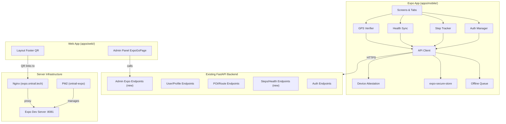
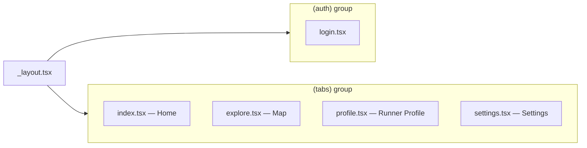

# Design Document: Expo Companion App

## Overview

The Expo Companion App is a React Native mobile application built with Expo that extends the OnTrail web platform to mobile devices. It communicates exclusively with the existing FastAPI backend at `api.ontrail.tech` — no new database or separate backend is introduced. The app provides mobile-native capabilities (step counting, health sync, GPS-secured POI verification, push notifications, device attestation) while reusing the same auth flows, user model, and token economy already powering the web app.

The infrastructure additions are minimal: a PM2-managed Expo dev server process, an `expo.ontrail.tech` subdomain with nginx proxy + WebSocket support, and a DNS A record. The web app gets a QR code in its footer linking to the Expo Go URL, plus an admin panel section for managing the Expo Go process.

### Key Design Decisions

1. **Shared API client pattern** — The mobile `apiClient` mirrors `apps/web/src/lib/api.ts` in structure (base URL, 401 interceptor, token refresh) but uses `expo-secure-store` instead of `localStorage` for token persistence.
2. **Expo Router for navigation** — File-based routing via `expo-router` with a tab layout (`(tabs)/`) and an auth group (`(auth)/`). This aligns with the existing `apps/mobile/app/` directory already configured for expo-router.
3. **No new backend endpoints for core features** — Auth, profile, POI, routes, tokens, and aura endpoints already exist. New endpoints are only needed for step sync (`POST /steps/sync`), health sync (`POST /health/sync`), device token registration (`POST/DELETE /users/me/device-token`), and the Expo Go admin management suite (`/admin/expo/*`).
4. **Offline-first with queue** — A lightweight request queue persisted to `AsyncStorage` handles offline step syncs and check-ins. On connectivity restore, queued requests replay in FIFO order with retry logic.
5. **Device attestation as header** — Attestation tokens from Apple App Attest / Google Play Integrity are attached as an `X-Device-Attestation` header on sensitive requests (steps, check-ins). The backend can score trust accordingly without blocking unattested devices.

## Architecture



### Navigation Structure



The root layout checks `SecureStore` for a valid token pair on mount. If valid, it renders the tab group; otherwise, the auth group.

## Components and Interfaces

### 1. API Client (`lib/apiClient.ts`)

```typescript
interface ApiClientConfig {
  baseUrl: string;           // https://api.ontrail.tech
  getAccessToken: () => Promise<string | null>;
  getRefreshToken: () => Promise<string | null>;
  setTokens: (access: string, refresh: string) => Promise<void>;
  clearTokens: () => Promise<void>;
  onSessionExpired: () => void;
}

interface ApiClient {
  request<T>(path: string, options?: RequestInit): Promise<T>;
  // Auth
  requestOtp(email: string): Promise<{ message: string; is_new_user: boolean }>;
  verifyOtp(email: string, code: string): Promise<AuthResponse>;
  authGoogle(idToken: string): Promise<AuthResponse>;
  authApple(identityToken: string): Promise<AuthResponse>;
  authChallenge(walletAddress: string): Promise<{ nonce: string; message: string }>;
  authWallet(walletAddress: string, signature: string, message: string): Promise<AuthResponse>;
  authRefresh(refreshToken: string): Promise<{ access_token: string }>;
  authLogout(refreshToken: string): Promise<void>;
  // Profile
  getMe(): Promise<AuthUser>;
  getRunner(username: string): Promise<RunnerProfile>;
  updateProfile(payload: ProfileUpdate): Promise<AuthUser>;
  uploadProfileImage(file: FormData): Promise<{ avatar_url: string }>;
  // POI & Map
  getNearbyPois(lat: number, lon: number, radiusKm: number): Promise<POI[]>;
  mintPoi(name: string, lat: number, lon: number): Promise<MintResult>;
  checkin(data: CheckinPayload): Promise<CheckinResult>;
  // Steps & Health
  syncSteps(payload: StepSyncPayload): Promise<void>;
  syncHealth(payload: HealthSyncPayload): Promise<void>;
  // Push
  registerDeviceToken(token: string): Promise<void>;
  unregisterDeviceToken(): Promise<void>;
}
```

The `request` method attaches `Bearer` auth, handles 401 → refresh → retry, and falls through to `onSessionExpired` on failure. All requests use TLS (the base URL is HTTPS). An `X-Device-Attestation` header is attached when an attestation token is available.

### 2. Auth Manager (`lib/authManager.ts`)

```typescript
interface AuthManager {
  // Token storage (expo-secure-store)
  getTokenPair(): Promise<TokenPair | null>;
  storeTokenPair(tokens: TokenPair): Promise<void>;
  clearTokenPair(): Promise<void>;
  // Session validation
  validateSession(): Promise<AuthUser | null>;
  // Auth flows
  loginWithOtp(email: string, code: string): Promise<void>;
  loginWithGoogle(): Promise<void>;
  loginWithApple(): Promise<void>;
  loginWithWallet(): Promise<void>;
  logout(): Promise<void>;
}

interface TokenPair {
  accessToken: string;
  refreshToken: string;
}
```

Token storage uses `expo-secure-store` which provides AES-256 encryption on both iOS (Keychain) and Android (Keystore). On app launch, `validateSession()` reads the stored pair, calls `GET /users/me`, and on 401 attempts a refresh before clearing.

### 3. Step Tracker (`lib/stepTracker.ts`)

```typescript
interface StepTracker {
  isAvailable(): Promise<boolean>;
  requestPermission(): Promise<boolean>;
  startTracking(): void;
  stopTracking(): void;
  getCurrentDaySteps(): Promise<number>;
  getStepsSince(date: Date): Promise<number>;
}

interface StepSyncPayload {
  steps: number;
  period_start: string;  // ISO 8601
  period_end: string;
  source: 'pedometer';
}
```

Uses `expo-sensors` Pedometer API. Syncs every 15 minutes (configurable between 5–30 min) while foregrounded. On foreground resume, queries pedometer for the background gap and syncs immediately.

### 4. Health Sync (`lib/healthSync.ts`)

```typescript
interface HealthSyncPayload {
  steps: number;
  distance_meters: number;
  calories_burned: number;
  period_start: string;
  period_end: string;
  source: 'apple_health' | 'google_fit';
}

interface HealthSync {
  isAvailable(): Promise<boolean>;
  requestPermissions(): Promise<boolean>;
  readTodayData(): Promise<HealthSyncPayload>;
  sync(): Promise<void>;
}
```

Uses `react-native-health` (iOS) / `react-native-google-fit` (Android). Syncs once per hour while foregrounded.

### 5. GPS Verifier (`lib/gpsVerifier.ts`)

```typescript
interface GPSVerifier {
  getCurrentPosition(highAccuracy: boolean): Promise<GPSPosition>;
  calculateDistance(a: Coordinates, b: Coordinates): number; // Haversine, meters
  verifyProximity(userPos: GPSPosition, poiPos: Coordinates, maxDistance: number): VerifyResult;
}

interface GPSPosition {
  latitude: number;
  longitude: number;
  accuracy: number;  // meters
  timestamp: number;
}

interface VerifyResult {
  allowed: boolean;
  distance: number;
  accuracyWarning: boolean;  // true if accuracy > 100m
}

interface CheckinPayload {
  poi_id: string;
  latitude: number;
  longitude: number;
  accuracy: number;
  timestamp: string;
  attestation_token?: string;
}
```

Uses `expo-location` with `Accuracy.High`. The Haversine formula computes great-circle distance. Check-in is rejected client-side if distance > 200m. A warning is shown if GPS accuracy > 100m.

### 6. Offline Queue (`lib/offlineQueue.ts`)

```typescript
interface QueuedRequest {
  id: string;
  path: string;
  method: string;
  body: string;
  createdAt: string;
  retryCount: number;
}

interface OfflineQueue {
  enqueue(request: QueuedRequest): Promise<void>;
  processQueue(): Promise<void>;
  getQueueSize(): Promise<number>;
}
```

Persisted to `AsyncStorage` under key `@ontrail/offline_queue`. On connectivity restore (via `NetInfo`), processes FIFO. Failed requests retry up to 3 times with exponential backoff (1s, 2s, 4s) before being discarded with a user notification.

### 7. Device Attestation (`lib/deviceAttestation.ts`)

```typescript
interface DeviceAttestation {
  isAvailable(): Promise<boolean>;
  getAttestationToken(): Promise<string | null>;
}
```

Platform-specific: Apple App Attest on iOS, Google Play Integrity on Android. Returns `null` if unavailable or failed — the request still proceeds with an `X-Device-Attestation: none` header so the backend can apply reduced trust.

### 8. Web Components

**QR Code in Footer** (`apps/web/src/components/Layout.tsx`):
- Renders a QR code SVG encoding `https://expo.ontrail.tech` in the desktop footer (hidden below 768px).
- Uses `qrcode.react` library for SVG generation at 120×120px minimum.
- Label: "Try the mobile app" with the URL displayed.

**ExpoGoPage** (`apps/web/src/pages/admin/ExpoGoPage.tsx`):
- Admin panel section with sidebar nav item "Expo Go".
- Displays: server status (running/stopped/errored), port, uptime, memory.
- Controls: restart button, port configuration form.
- Displays: last 50 log lines, active sessions count.
- Calls: `GET/POST /admin/expo/status|restart|logs|sessions`, `PUT /admin/expo/port`.

## Data Models

### New API Endpoints (Backend Additions)

#### Steps & Health

```
POST /steps/sync
  Body: { steps: int, period_start: str, period_end: str, source: str }
  Headers: Authorization, X-Device-Attestation
  Response: { message: str, daily_total: int }

POST /health/sync
  Body: { steps: int, distance_meters: float, calories_burned: float,
          period_start: str, period_end: str, source: str }
  Headers: Authorization, X-Device-Attestation
  Response: { message: str }
```

#### Apple Auth (new endpoint)

```
POST /auth/apple
  Body: { identity_token: str }
  Response: AuthResponse (same as Google/OTP flows)
```

#### Push Notifications

```
POST /users/me/device-token
  Body: { token: str, platform: str }
  Response: { message: str }

DELETE /users/me/device-token
  Response: { message: str }
```

#### Expo Go Admin

```
GET    /admin/expo/status    → { status, port, uptime, memory_mb, pid }
POST   /admin/expo/restart   → { status, message }
PUT    /admin/expo/port      → { port, message }
GET    /admin/expo/logs      → { lines: string[] }
GET    /admin/expo/sessions  → { count, sessions: [] }
```

### Infrastructure Additions

#### PM2 Ecosystem Entry

```javascript
{
  name: 'ontrail-expo',
  cwd: './apps/mobile',
  script: 'npx',
  args: 'expo start --port 8081 --tunnel',
  interpreter: 'none',
  env: { NODE_ENV: 'development' },
}
```

#### Nginx Server Block (expo.ontrail.tech)

```nginx
server {
    listen 443 ssl http2;
    server_name expo.ontrail.tech;
    # SSL certs (same wildcard)
    location / {
        proxy_pass http://127.0.0.1:8081;
        proxy_http_version 1.1;
        proxy_set_header Upgrade $http_upgrade;
        proxy_set_header Connection "upgrade";
        proxy_set_header Host $host;
    }
}
```

#### DNS A Record

```
expo    IN  A   85.208.51.194
```

### Existing Data Models Consumed

The mobile app consumes the same models already defined in the backend:

| Model | Key Fields | Source Endpoint |
|-------|-----------|-----------------|
| `AuthUser` | id, username, email, wallet_address, avatar_url, reputation_score, roles, step_balance | `GET /users/me` |
| `AuthResponse` | access_token, refresh_token, user | All auth endpoints |
| `POI` | id, name, latitude, longitude, rarity, description | `GET /poi/nearby` |
| `RunnerProfile` | username, bio, reputation, rank, aura, friendpass stats | `GET /users/runner/{username}` |

### On-Device Storage Schema

| Key | Store | Content |
|-----|-------|---------|
| `ontrail_access_token` | SecureStore (AES) | JWT access token |
| `ontrail_refresh_token` | SecureStore (AES) | JWT refresh token |
| `@ontrail/offline_queue` | AsyncStorage | JSON array of QueuedRequest |
| `@ontrail/cached_profile` | AsyncStorage | Last fetched AuthUser JSON |
| `@ontrail/cached_pois` | AsyncStorage | Last fetched nearby POI list |
| `@ontrail/cached_steps` | AsyncStorage | Current day step count |
| `@ontrail/push_token` | AsyncStorage | Expo push token string |


## Correctness Properties

*A property is a characteristic or behavior that should hold true across all valid executions of a system — essentially, a formal statement about what the system should do. Properties serve as the bridge between human-readable specifications and machine-verifiable correctness guarantees.*

### Property 1: API client uses HTTPS base URL with JSON headers

*For any* API request made by the client, the request URL must start with `https://api.ontrail.tech` and the `Content-Type` header must be `application/json` (unless the body is FormData).

**Validates: Requirements 1.1, 1.5**

### Property 2: Bearer token attachment on authenticated requests

*For any* API request made while a valid token pair exists in secure storage, the request must include an `Authorization: Bearer <access_token>` header where the token matches the stored access token.

**Validates: Requirements 1.2**

### Property 3: 401 triggers refresh-then-retry

*For any* authenticated API request that receives an HTTP 401 response, the client must attempt exactly one token refresh using the stored refresh token and retry the original request exactly once before giving up.

**Validates: Requirements 1.3**

### Property 4: Failed refresh clears token storage

*For any* token refresh attempt that fails (non-2xx response or network error), the secure storage must contain no access token and no refresh token after the failure is handled.

**Validates: Requirements 1.4, 6.4**

### Property 5: Token storage round trip

*For any* valid AuthResponse containing an access_token and refresh_token, storing the token pair in secure storage and then retrieving it must yield the exact same access_token and refresh_token values.

**Validates: Requirements 2.4, 3.3, 4.4, 5.5, 6.1**

### Property 6: Auth method routes to correct endpoint with correct payload

*For any* auth method (OTP email, OTP verify, Google, Apple, wallet challenge, wallet auth) and valid credentials, the auth manager must call the correct API endpoint (`/auth/request-otp`, `/auth/verify-otp`, `/auth/google`, `/auth/apple`, `/auth/challenge`, `/auth/wallet` respectively) with all required fields from the credentials.

**Validates: Requirements 2.1, 2.3, 3.2, 4.3, 5.2, 5.4**

### Property 7: Logout clears all stored tokens

*For any* authenticated session, calling logout must result in secure storage containing no access token and no refresh token, regardless of whether the `POST /auth/logout` API call succeeds or fails.

**Validates: Requirements 6.5**

### Property 8: Step sync interval is bounded between 5 and 30 minutes

*For any* sequence of step sync submissions while the app is foregrounded, the time interval between consecutive sync calls must be no less than 5 minutes and no greater than 30 minutes.

**Validates: Requirements 7.3**

### Property 9: Health sync interval is approximately 1 hour

*For any* sequence of health sync submissions while the app is foregrounded and health permissions are granted, the time interval between consecutive sync calls must be approximately 60 minutes (±5 minutes tolerance).

**Validates: Requirements 8.4**

### Property 10: Runner profile rendering includes all required fields

*For any* runner profile API response, the rendered profile screen must display the username, avatar, bio, reputation score, rank, aura level, step balance, FriendPass stats (sold count, max supply, current price), and supporter count.

**Validates: Requirements 9.1, 9.5, 9.6**

### Property 11: Profile update sends correct payload

*For any* non-empty subset of editable profile fields (username, email, bio, location, preferred_reward_wallet), submitting the edit form must call `PATCH /users/me/profile` with exactly the modified fields in the request body.

**Validates: Requirements 9.3**

### Property 12: POI nearby query uses map center coordinates

*For any* map center coordinates (latitude, longitude), loading or panning the map must trigger a call to `GET /poi/nearby` with those coordinates and a radius of 10 km.

**Validates: Requirements 10.2**

### Property 13: Rarity-to-color mapping is deterministic and complete

*For any* POI rarity value in {common, rare, epic, legendary}, the color mapping function must return exactly one color: gray for common, blue for rare, purple for epic, gold for legendary. No other rarity value is accepted.

**Validates: Requirements 10.3**

### Property 14: Haversine distance calculation

*For any* two GPS coordinate pairs (lat1, lon1) and (lat2, lon2) with valid ranges (latitude ∈ [-90, 90], longitude ∈ [-180, 180]), the Haversine function must return a non-negative distance in meters that equals the known great-circle distance formula result within 1 meter tolerance.

**Validates: Requirements 11.2**

### Property 15: Proximity gate for POI check-in

*For any* user GPS position and POI position, the check-in is allowed if and only if the Haversine distance between them is ≤ 200 meters. When allowed, the check-in request must include the POI ID, user coordinates, and a timestamp. When rejected, no API call is made.

**Validates: Requirements 11.3, 11.4**

### Property 16: Check-in payload always includes GPS accuracy

*For any* check-in request sent to the backend, the request body must contain an `accuracy` field with the device's GPS accuracy value in meters.

**Validates: Requirements 11.5**

### Property 17: GPS accuracy warning threshold

*For any* GPS reading with an accuracy value greater than 100 meters, the GPS verifier must produce a warning result (`accuracyWarning: true`). For accuracy ≤ 100 meters, no warning is produced.

**Validates: Requirements 11.6**

### Property 18: Unauthenticated state hides tab navigator

*For any* app state where no valid token pair exists in secure storage, the tab navigator must not be rendered and only the login screen is visible.

**Validates: Requirements 12.6**

### Property 19: Cache round trip for profile and POI data

*For any* fetched runner profile or POI list, writing it to the local cache and then reading it back must yield data identical to the original fetched data.

**Validates: Requirements 13.1**

### Property 20: Offline requests are enqueued

*For any* step sync or check-in request attempted while the device has no network connectivity, the request must be added to the offline queue in AsyncStorage and the queue size must increase by exactly one.

**Validates: Requirements 13.3**

### Property 21: Offline queue processes in FIFO order

*For any* offline queue containing N requests, when connectivity is restored, the requests must be processed in the exact order they were enqueued (earliest createdAt first).

**Validates: Requirements 13.4**

### Property 22: Offline queue retries with exponential backoff

*For any* queued request that fails after connectivity is restored, the queue must retry the request up to 3 times with exponential backoff intervals (1s, 2s, 4s). After 3 failures, the request is discarded and the queue size decreases by one.

**Validates: Requirements 13.5**

### Property 23: Push notification deep-link routing

*For any* notification payload containing a `screen` field with value in {profile, explore, home}, tapping the notification must navigate to the corresponding screen. Unknown screen values default to the home screen.

**Validates: Requirements 14.3**

### Property 24: Attestation header on sensitive requests

*For any* step sync or GPS check-in request, the request headers must include an `X-Device-Attestation` field. If attestation is available, the value is the attestation token. If unavailable, the value is `none`.

**Validates: Requirements 15.1**

### Property 25: Attestation failure does not block requests

*For any* step sync or check-in request where device attestation fails or is unavailable, the request must still be sent to the backend (not blocked), with the attestation header set to `none`.

**Validates: Requirements 15.4**

### Property 26: Expo status endpoint returns all required fields

*For any* PM2 process state (running, stopped, errored), the `GET /admin/expo/status` response must contain the fields: status, port, uptime, memory_mb, and pid.

**Validates: Requirements 17.2, 18.4**

### Property 27: Expo logs endpoint returns at most 50 lines

*For any* Expo Go log file of N lines, the `GET /admin/expo/logs` endpoint must return min(N, 50) lines, taken from the end of the file.

**Validates: Requirements 18.7**

## Error Handling

### Network Errors

| Scenario | Behavior |
|----------|----------|
| No connectivity | Enqueue mutable requests (step sync, check-in) to offline queue. Show offline banner. Serve cached data for reads. |
| Request timeout (>15s) | Abort and show "Connection timed out" toast. Do not enqueue — user can retry manually. |
| HTTP 401 | Attempt token refresh → retry once → on failure clear tokens and redirect to login. |
| HTTP 4xx (non-401) | Display API error message to user. Do not retry. |
| HTTP 5xx | Display "Server error, please try again" toast. Do not auto-retry. |

### Auth Errors

| Scenario | Behavior |
|----------|----------|
| Invalid OTP code | Show API error message, keep OTP input screen open for retry. |
| OAuth cancelled (Google/Apple) | Return to login screen silently — no error displayed. |
| Wallet signing rejected | Return to login screen silently — no error displayed. |
| Token refresh fails | Clear secure storage, navigate to login. |

### Sensor Errors

| Scenario | Behavior |
|----------|----------|
| No pedometer sensor | Show "Step counting unavailable on this device" message on home screen. Disable step-related UI. |
| GPS unavailable | Show "Enable location services" prompt on Explore screen. Disable check-in and mint buttons. |
| GPS accuracy > 100m | Show warning banner: "Weak GPS signal — check-in may be rejected." Allow attempt. |
| Health permissions denied | Continue with pedometer-only steps. Show prompt in Settings to enable health sync. |
| Device attestation fails | Proceed with request, set attestation header to `none`. Log warning locally. |

### Offline Queue Errors

| Scenario | Behavior |
|----------|----------|
| Queued request fails on replay | Retry up to 3 times with exponential backoff (1s, 2s, 4s). |
| All retries exhausted | Discard request, show notification: "Some offline actions could not be synced." |
| Queue corruption | Clear queue, log error. User loses unsynced offline actions. |

### Admin Expo Errors

| Scenario | Behavior |
|----------|----------|
| Status endpoint fails | Show "Expo Go server status unavailable" error in ExpoGoPage. |
| Restart fails | Show error message from API response. |
| Invalid port number | Client-side validation: port must be 1024–65535. Reject before API call. |

## Testing Strategy

### Testing Framework

- **Unit & integration tests**: Vitest (already used across the project)
- **Property-based tests**: `fast-check` library for TypeScript
- **Minimum iterations**: 100 per property test

### Unit Tests

Unit tests cover specific examples, edge cases, and integration points:

- Auth flow happy paths (OTP, Google, Apple, wallet) — mock API responses
- Token storage/retrieval with `expo-secure-store` mock
- Offline queue enqueue/dequeue with empty queue, single item, multiple items
- GPS verifier with known coordinate pairs (e.g., Eiffel Tower to Arc de Triomphe)
- Rarity color mapping for all four values + invalid input
- Step tracker permission denied scenario
- Admin ExpoGoPage rendering with mock status data
- QR code renders correct URL in footer
- Deep-link routing for each notification type

### Property-Based Tests

Each property test references its design document property and runs a minimum of 100 iterations.

| Property | Test Description | Tag |
|----------|-----------------|-----|
| P1 | Generate random paths, verify URL prefix and headers | Feature: expo-companion-app, Property 1: API client uses HTTPS base URL with JSON headers |
| P2 | Generate random tokens, verify Bearer header matches | Feature: expo-companion-app, Property 2: Bearer token attachment |
| P3 | Simulate 401 responses on random paths, verify refresh+retry | Feature: expo-companion-app, Property 3: 401 triggers refresh-then-retry |
| P4 | Simulate failed refreshes, verify storage is empty | Feature: expo-companion-app, Property 4: Failed refresh clears token storage |
| P5 | Generate random token pairs, store and retrieve, verify equality | Feature: expo-companion-app, Property 5: Token storage round trip |
| P6 | Generate random credentials per auth method, verify endpoint+payload | Feature: expo-companion-app, Property 6: Auth method routes to correct endpoint |
| P7 | Generate random token states, call logout, verify storage empty | Feature: expo-companion-app, Property 7: Logout clears all stored tokens |
| P8 | Generate random sync timestamps, verify interval bounds | Feature: expo-companion-app, Property 8: Step sync interval bounds |
| P9 | Generate random health sync timestamps, verify ~60min interval | Feature: expo-companion-app, Property 9: Health sync interval |
| P10 | Generate random profile responses, verify all fields rendered | Feature: expo-companion-app, Property 10: Runner profile required fields |
| P11 | Generate random profile field subsets, verify PATCH payload | Feature: expo-companion-app, Property 11: Profile update sends correct payload |
| P12 | Generate random lat/lon pairs, verify API call params | Feature: expo-companion-app, Property 12: POI nearby query coordinates |
| P13 | Generate random rarity values, verify color mapping | Feature: expo-companion-app, Property 13: Rarity-to-color mapping |
| P14 | Generate random coordinate pairs, verify Haversine against reference | Feature: expo-companion-app, Property 14: Haversine distance calculation |
| P15 | Generate random user+POI positions, verify allow/reject matches distance | Feature: expo-companion-app, Property 15: Proximity gate for check-in |
| P16 | Generate random check-in payloads, verify accuracy field present | Feature: expo-companion-app, Property 16: Check-in payload includes accuracy |
| P17 | Generate random accuracy values, verify warning threshold at 100m | Feature: expo-companion-app, Property 17: GPS accuracy warning threshold |
| P18 | Generate random auth states (with/without tokens), verify tab visibility | Feature: expo-companion-app, Property 18: Unauthenticated hides tabs |
| P19 | Generate random profile/POI data, cache and read back, verify equality | Feature: expo-companion-app, Property 19: Cache round trip |
| P20 | Generate random requests while offline, verify queue grows by 1 | Feature: expo-companion-app, Property 20: Offline requests enqueued |
| P21 | Generate random queue orderings, verify FIFO processing | Feature: expo-companion-app, Property 21: Offline queue FIFO order |
| P22 | Generate random failing requests, verify 3 retries then discard | Feature: expo-companion-app, Property 22: Offline queue retry with backoff |
| P23 | Generate random notification payloads, verify screen routing | Feature: expo-companion-app, Property 23: Push notification deep-link routing |
| P24 | Generate random attestation states, verify header presence | Feature: expo-companion-app, Property 24: Attestation header on sensitive requests |
| P25 | Generate failed attestation scenarios, verify request still sent | Feature: expo-companion-app, Property 25: Attestation failure does not block |
| P26 | Generate random PM2 states, verify response contains all fields | Feature: expo-companion-app, Property 26: Expo status response shape |
| P27 | Generate random log files of varying length, verify max 50 lines returned | Feature: expo-companion-app, Property 27: Expo logs max 50 lines |

### Test File Organization

```
apps/mobile/lib/__tests__/
  apiClient.test.ts          # P1–P4, unit tests for request/retry
  authManager.test.ts        # P5–P7, unit tests for auth flows
  stepTracker.test.ts        # P8, unit tests for pedometer
  healthSync.test.ts         # P9, unit tests for health sync
  gpsVerifier.test.ts        # P14–P17, unit tests for Haversine/proximity
  offlineQueue.test.ts       # P19–P22, unit tests for queue
  deviceAttestation.test.ts  # P24–P25, unit tests for attestation

apps/web/src/lib/__tests__/
  rarityColors.test.ts       # P13
  expoAdmin.test.ts          # P26–P27

apps/web/src/components/__tests__/
  FooterQR.test.ts           # QR code unit tests

services/api/tests/
  test_expo_admin.py         # P26–P27 backend tests
  test_steps_sync.py         # Steps endpoint tests
  test_health_sync.py        # Health endpoint tests
```
