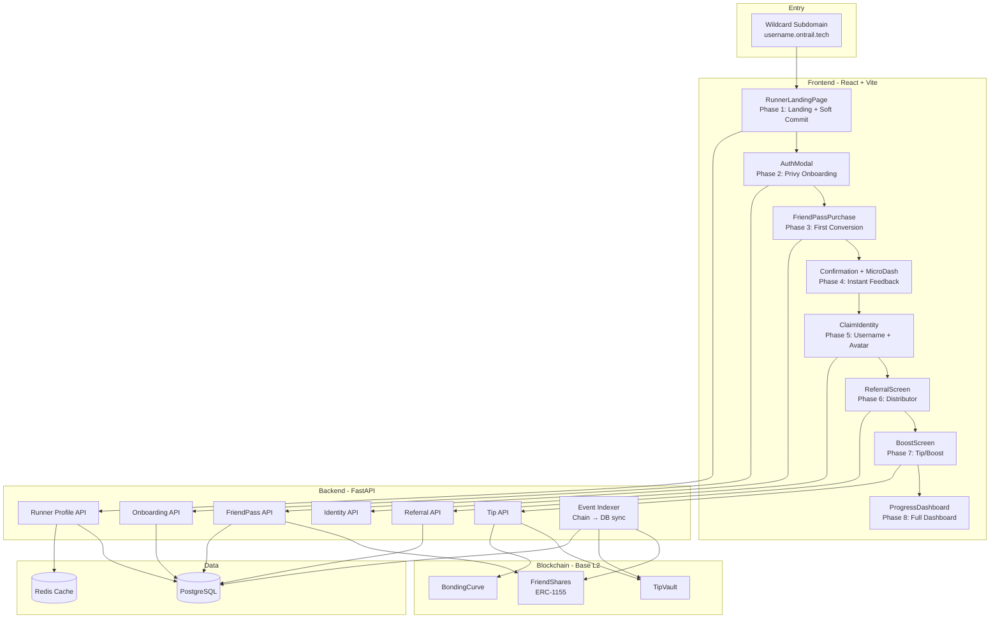
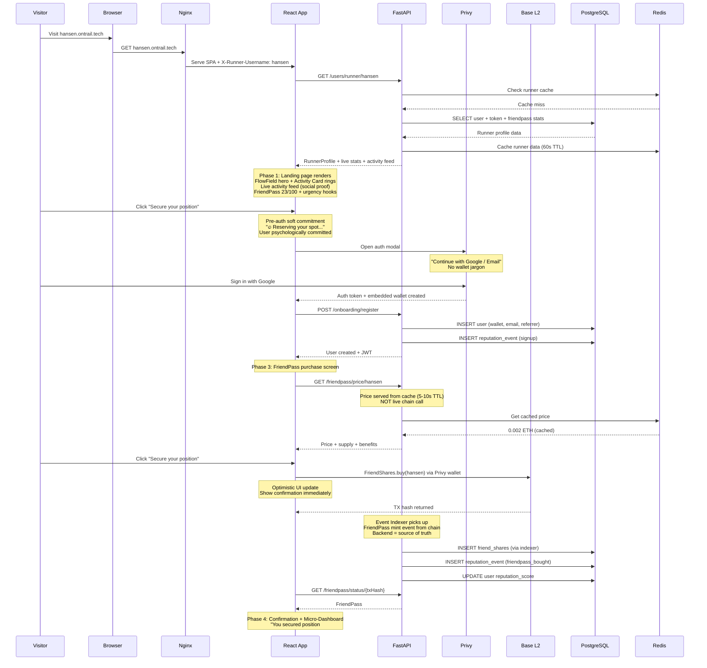
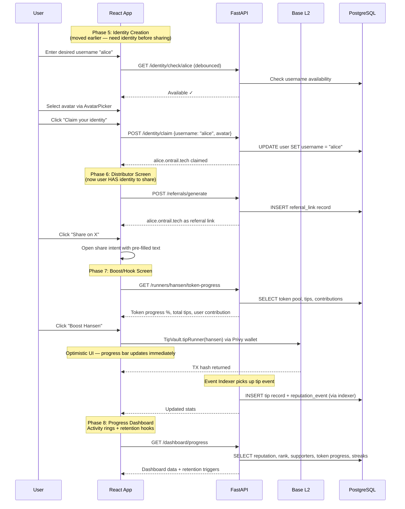
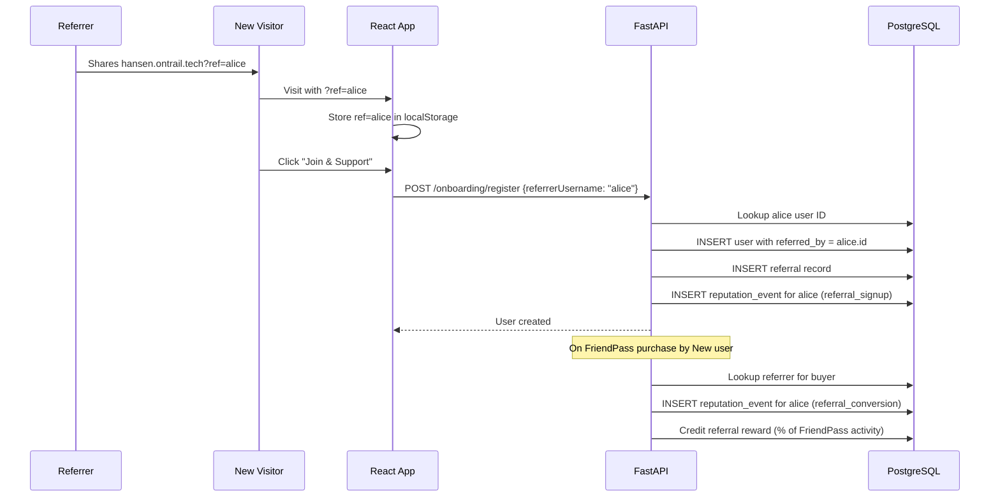

# Design Document: First-Time User Journey

## Overview

The First-Time User Journey converts a new visitor arriving at a runner's subdomain (e.g. `hansen.ontrail.tech`) into a registered user, FriendPass holder, token economy participant, and promoter — all within 5 minutes. The flow is an 8-phase funnel: Landing (with pre-auth soft commitment) → Instant Onboarding → First Conversion (FriendPass purchase) → Confirmation + Micro-Dashboard → Identity Creation → Distributor (referral sharing) → Hook (tip/boost) → Progress Dashboard.

The system leverages the existing wildcard subdomain infrastructure (nginx captures `username` from `*.ontrail.tech`), Privy for frictionless auth (email/social → embedded wallet, zero crypto jargon), the ERC-1155 FriendPass contract for social investment, the BondingCurve/TipVault contracts for tipping, and a new referral tracking system. Every screen is optimized for 1-2 clicks max, instant feedback, and clear financial upside messaging. The frontend uses [KokonutUI](https://kokonutui.com/) components (Flow Field hero background, Avatar Picker, Profile Dropdown, Smooth Drawer, Apple Activity Card, and a branded full-screen Loader) alongside React components rendered conditionally based on journey phase, with a lightweight state machine driving progression.

### Key Design Principles

- **Pre-auth soft commitment**: User psychologically "decides" before seeing a login modal — reduces friction
- **Backend as source of truth**: On-chain events indexed by backend; frontend confirmation is optional/optimistic
- **Cached pricing**: FriendPass prices cached in backend (5-10s TTL), only verified on-chain during actual buy
- **Positioning language**: "Secure your position" / "Get in early" instead of "Buy FriendPass"
- **Immediate feedback**: Micro-dashboard shown right after FriendPass purchase — rank, percentile, early status
- **Identity before referral**: Users claim their subdomain identity before being asked to share — they need something to share
- **Emotional referral feedback**: Visible, celebratory notifications when referrals convert
- **Live social proof**: Activity feed on landing page showing recent joins, buys, and tips
- **Retention hooks**: Daily streaks, rank movement notifications, nearby POI alerts to drive return visits
- **Loss-based re-engagement**: "Someone passed you", "You dropped rank" — loss aversion drives action harder than gains
- **Shareable cards**: Auto-generated, beautiful, brag-worthy cards for every milestone — primary viral distribution
- **Influence graph**: Visible network tree showing "people under you" and total network value in ETH
- **Visual identity**: Light, flowing, epic — derived from the hero illustration (`/hero26.png`) and OnTrail wordmark (`/ontrail-logo.png`). Emerald/green primary, anime trail-runner aesthetic, generous whitespace, flowing motion.

## Architecture



## Sequence Diagrams

### Full User Journey Flow (Phases 1-4)



### Phases 5-8: Identity, Referral, Boost, Dashboard



### Referral Attribution Flow



## Visual Design Language

### Brand Assets

All brand assets are served from the Vite public directory (`apps/web/public/`) and available at root-relative paths:

| Asset | Path | Usage |
|---|---|---|
| OnTrail Logo | `/ontrail-logo.png` | Navbar, hero section, footer, shareable cards, OG images. Dark wordmark — use `brightness-0 invert` for white-on-dark contexts. |
| Hero Illustration | `/hero26.png` | Main landing page hero image. Anime-style runner on mountain trail with clouds, sunrise, and epic scale. Sets the visual tone for the entire platform. |

### Design Direction: Light, Flowing, Epic

The visual identity is derived directly from the hero illustration (`hero26.png`) and the clean OnTrail wordmark. Every page and component must feel like an extension of this world.

**Color Palette** (extracted from hero illustration):
- Primary: Emerald/Green (`#10b981` → `#22c55e`) — trails, nature, growth, CTAs
- Accent warm: Sunrise amber/gold (`#f59e0b`) — achievements, legendary rarity, TGE events
- Accent cool: Sky teal (`#14b8a6`) — water, exploration, secondary actions
- Mountain slate: (`#475569` → `#1e293b`) — depth, contrast, dark hero sections
- Cloud white: (`#f8fafc`) — light backgrounds, breathing room, content areas
- Rose/Pink: (`#ec4899`) — from runner's outfit — used sparingly for alerts, loss notifications

**Design Principles**:
- **Light and airy**: Default backgrounds are white/slate-50 with generous whitespace. Dark sections (hero, CTAs) are the exception, not the rule.
- **Flowing motion**: All transitions use ease-out curves. Page elements fade up on scroll. Parallax on hero. Nothing snaps — everything flows.
- **Epic scale**: Hero sections are full-viewport. Images are large. Typography is bold. The feeling is "you're about to do something big."
- **Illustration-forward**: The anime trail-runner aesthetic carries through — rounded corners, soft gradients, warm lighting feel. Not corporate. Not cold.
- **Depth through layering**: Glass morphism (backdrop-blur), subtle shadows, gradient orbs behind content. Creates depth without heaviness.

**Typography**:
- Font: Inter (400, 500, 600, 700, 800)
- Headlines: 800 weight, tight tracking, gradient text for emphasis
- Body: 400-500 weight, relaxed leading, slate-400/500 for secondary text
- Mono: For wallet addresses, referral codes, technical data

**Component Styling Rules**:
- Buttons: Rounded-2xl, gradient backgrounds, shadow-xl on hover, -translate-y-1 lift effect
- Cards: Rounded-2xl, border border-slate-200 (light) or border-white/10 (dark), backdrop-blur-sm
- Badges: Rounded-full, small text, gradient or solid backgrounds
- Progress bars: Rounded-full, gradient fills, animated width transitions
- All interactive elements: transition-all duration-300

**Hero Section Pattern** (reusable across landing pages):
```
┌─────────────────────────────────────────────┐
│  [dark gradient bg + animated glow orbs]    │
│                                             │
│         [OnTrail logo - white]              │
│         [Badge: "Built on Base"]            │
│         [Headline - gradient text]          │
│         [Subheadline - slate-400]           │
│         [CTA buttons]                       │
│                                             │
│    ┌─────────────────────────────────┐      │
│    │  [hero26.png - glass border]    │      │
│    │  [emerald glow underneath]      │      │
│    │  [bottom fade to next section]  │      │
│    └─────────────────────────────────┘      │
│                                             │
│         [scroll indicator]                  │
└─────────────────────────────────────────────┘
```

**Navbar**:
- Uses `/ontrail-logo.png` as the home link (replaces emoji + text)
- Sticky, backdrop-blur-xl, bg-white/80
- Clean, minimal — logo left, nav center, auth right

**Shareable Card Styling** (must match brand):
- Gradient backgrounds matching achievement type (emerald for FriendPass, amber for legendary, purple for milestones)
- OnTrail logo watermark in corner
- User's `username.ontrail.tech` URL prominently displayed
- Stats in clean grid layout
- Must look good on X timeline, Instagram stories, and as OG previews

## UI Component Library: KokonutUI

The frontend uses [KokonutUI](https://kokonutui.com/) as the primary component library, installed via the shadcn CLI with a custom registry. KokonutUI provides polished, animated React components built on Tailwind CSS v4 and Framer Motion.

### Setup

1. Initialize shadcn and add the KokonutUI registry to `components.json`:
```json
{
  "registries": {
    "@kokonutui": "https://kokonutui.com/r/{name}.json"
  }
}
```

2. Install the base utilities:
```bash
npx shadcn@latest add https://kokonutui.com/r/utils.json
```

3. For the monorepo, use the `-c` flag targeting the web app:
```bash
npx shadcn@latest add @kokonutui/<component> -c ./apps/web
```

### KokonutUI Components Used

| Component | Package | Usage |
|---|---|---|
| Flow Field | `@kokonutui/flow-field` | Landing page hero background — canvas particle flow field with organic noise-driven glowing light streams. Used as a light, ambient backdrop behind the runner profile on Phase 1. |
| Avatar Picker | `@kokonutui/avatar-picker` | Phase 7 (Identity Creation) — avatar selection with rotation animation when user claims their runner identity. |
| Profile Dropdown | `@kokonutui/profile-dropdown` | Sitewide navigation — authenticated user menu dropdown with avatar, name, email, and action buttons (profile, settings, logout). |
| Smooth Drawer | `@kokonutui/smooth-drawer` | Sitewide mobile navigation — slide-in drawer for mobile menu, phase navigation, and contextual panels. |
| Loader | `@kokonutui/loader` | Sitewide loading state — used as a big, colorful full-screen loader during page transitions, transaction confirmations, and initial app boot. Styled with OnTrail brand colors and scaled up for visual impact. |
| Apple Activity Card | `@kokonutui/apple-activity-card` | Profile reputation visualizer — concentric animated rings showing steps, reputation score, and token activity. Used on runner landing pages and the Phase 8 dashboard as a compact, glanceable activity summary. |

### Component Mapping to Journey Phases

- **Phase 1 (Landing)**: `FlowField` as hero background, `AppleActivityCard` showing runner's reputation rings, live activity feed for social proof
- **Phase 2 (Onboarding)**: `Loader` shown during Privy auth + wallet creation
- **Phase 3 (FriendPass)**: `Loader` during transaction confirmation (optimistic UI)
- **Phase 4 (Confirmation + Micro-Dashboard)**: Instant rank/percentile/early status feedback
- **Phase 5 (Identity)**: `AvatarPicker` for avatar selection during username claim — moved earlier so users have identity before sharing
- **Phase 6 (Referral)**: Share buttons with user's claimed `username.ontrail.tech` link + emotional conversion notifications
- **Phase 7 (Hook/Boost)**: `Loader` during tip transaction, momentum meter ("🚀 72% to launch")
- **Phase 8 (Dashboard)**: `AppleActivityCard` as reputation visualizer (rings for steps, reputation, token activity), `ProfileDropdown` in nav, retention hooks (streaks, rank movement)
- **Sitewide**: `SmoothDrawer` for mobile nav, `ProfileDropdown` for desktop nav, `Loader` for all loading/transition states

## Components and Interfaces

### Component 1: RunnerLandingPage (Phase 1)

**Purpose**: Renders the runner's subdomain landing page with live stats, emotional hooks, social proof activity feed, and a single CTA using positioning language. Uses KokonutUI `FlowField` as a light, ambient hero background and `AppleActivityCard` for reputation rings. Includes pre-auth soft commitment — user clicks "Secure your position" which shows a reservation animation BEFORE the auth modal, reducing cognitive friction. Must load in under 2 seconds.

**Interface**:
```typescript
interface RunnerLandingPageProps {
  runnerUsername: string; // extracted from subdomain
}

interface RunnerProfileData {
  id: string;
  username: string;
  avatarUrl: string | null;
  reputationScore: number;
  rank: number;
  tokenStatus: 'bonding_curve' | 'tge_ready' | 'launched';
  friendPass: {
    sold: number;
    maxSupply: number;
    currentPrice: string;   // ETH (from backend cache, NOT live chain)
    currentPriceFiat: string; // USD equivalent
    nextPrice: string;      // ETH
  };
  stats: {
    totalSupporters: number;
    totalTips: string;      // ETH
    tokenProgress: number;  // 0-100%
  };
  activityFeed: ActivityFeedItem[];  // recent social proof events
}

interface ActivityFeedItem {
  type: 'join' | 'friendpass_buy' | 'tip' | 'rank_up';
  username: string | null;   // anonymized if no claimed name
  amount: string | null;     // ETH amount for buys/tips
  timeAgo: string;           // "2 min ago"
}
```

**Responsibilities**:
- Extract runner username from subdomain via `window.location.hostname`
- Fetch runner profile data from API with Redis caching (includes cached FriendPass price, 5-10s TTL)
- Render `FlowField` (KokonutUI) as hero background — light color scheme, reduced particle count for performance
- Render `AppleActivityCard` (KokonutUI) showing runner's reputation rings: Steps (green), Reputation (orange), Token Activity (pink)
- Display live activity feed: "🔥 3 people joined in last hour", "💰 Latest buy: 0.003 ETH" — social proof
- Display urgency hooks with positioning language ("23/100 positions remaining", "Price increases after each mint")
- Display momentum meter: "🚀 72% to launch" instead of just a percentage
- Single CTA button: "Secure your position" (NOT "Buy FriendPass")
- **Pre-auth soft commitment flow**: On CTA click, show "🔥 Reserving your spot..." animation for 1-2 seconds, THEN open Privy auth modal. User has psychologically committed before seeing login.
- Store `?ref=` query param in localStorage for referral attribution

### Component 2: OnTrailLoader (Sitewide)

**Purpose**: Full-screen loading component used during page transitions, transaction confirmations, and initial app boot. Built on KokonutUI `Loader` component, scaled up and styled with OnTrail brand colors for a big, colorful visual impact.

**Interface**:
```typescript
interface OnTrailLoaderProps {
  message?: string;         // e.g. "Confirming transaction...", "Setting up your wallet..."
  subMessage?: string;      // e.g. "Please wait while we prepare everything for you"
  variant?: 'fullscreen' | 'inline';  // fullscreen for page transitions, inline for sections
}
```

**Responsibilities**:
- Wrap KokonutUI `Loader` with OnTrail branding (colors, messaging)
- Display contextual messages based on current journey phase
- Full-screen overlay during: Privy auth, FriendPass purchase TX, tip TX, initial page load
- Inline variant for section-level loading (e.g., fetching runner data)
- Animated transitions in/out using framer-motion

### Component 3: JourneyOrchestrator (State Machine)

**Purpose**: Manages the user's progression through all 8 phases using a lightweight state machine. Persists phase to localStorage so returning users resume where they left off. Phase order optimized for: immediate feedback → identity ownership → viral distribution → deeper engagement.

**Interface**:
```typescript
type JourneyPhase =
  | 'landing'
  | 'onboarding'
  | 'friendpass_purchase'
  | 'confirmation'       // now includes micro-dashboard
  | 'identity'           // moved earlier — before referral
  | 'referral'
  | 'hook'
  | 'dashboard';

interface JourneyState {
  phase: JourneyPhase;
  runnerUsername: string;
  userId: string | null;
  friendPassId: string | null;
  referrerUsername: string | null;
  claimedUsername: string | null;
  completedPhases: JourneyPhase[];
  softCommitted: boolean;  // true after "Secure your position" click, before auth
}

interface JourneyOrchestrator {
  currentPhase: JourneyPhase;
  advance(): void;               // move to next phase
  skipTo(phase: JourneyPhase): void;
  canAdvance(): boolean;
  getState(): JourneyState;
}
```

**Responsibilities**:
- Track current phase and completed phases
- Gate phase transitions (e.g., can't reach Phase 3 without auth)
- Persist journey state to localStorage
- Provide phase-specific component rendering
- Handle skip logic (Phase 5 Identity is optional but encouraged)
- Track soft commitment state (pre-auth)

### Component 4: FriendPassPurchase (Phase 3)

**Purpose**: Renders the FriendPass purchase screen with supply visualization, cached price info, benefits list, and 1-click buy via Privy embedded wallet. Uses positioning language ("Secure your position") instead of "Buy FriendPass". Price is served from backend cache (5-10s TTL), only verified on-chain during actual buy transaction.

**Interface**:
```typescript
interface FriendPassPurchaseProps {
  runnerId: string;
  runnerUsername: string;
  onPurchaseComplete: (result: FriendPassResult) => void;
}

interface FriendPassResult {
  friendPassNumber: number;   // e.g. 24
  totalSupply: number;        // e.g. 100
  percentile: number;         // e.g. 24 (top 24%)
  txHash: string;
  pricePaid: string;          // ETH
}

interface FriendPassPriceInfo {
  currentPrice: string;       // ETH in wei (from backend cache)
  currentPriceFiat: string;   // USD equivalent
  nextPrice: string;          // ETH after this mint
  currentSupply: number;
  maxSupply: number;
  benefits: string[];
}
```

**Responsibilities**:
- Fetch current FriendPass price from API cache (5-10s TTL, NOT live chain call)
- Display supply bar (e.g., "23/100 positions secured"), current price in ETH + fiat
- Show benefits: early token access, better entry price, reputation boost
- Execute 1-click purchase via Privy embedded wallet (no manual gas/wallet steps)
- **Optimistic UI**: Show confirmation immediately after TX submitted, don't wait for on-chain confirmation
- Show urgency with positioning language: "Price increases to X after this position"
- Handle transaction confirmation and error states
- Anti-whale: enforce max 3-5 passes per wallet (contract-level)

### Component 5: BoostScreen (Phase 7 — Hook)

**Purpose**: Shows the runner's token progress with a momentum meter and encourages the user to tip/boost the runner, contributing to TGE funding. Uses optimistic UI — progress bar updates immediately, backend event indexer confirms.

**Interface**:
```typescript
interface BoostScreenProps {
  runnerId: string;
  runnerUsername: string;
  userId: string;
}

interface TokenProgressData {
  tokenStatus: 'bonding_curve' | 'tge_ready' | 'launched';
  progressPercent: number;      // % toward TGE threshold
  totalTips: string;            // ETH
  userContribution: string;     // ETH (this user's tips)
  tgeThreshold: string;         // ETH needed for TGE
  supporterCount: number;
  momentum: 'building' | 'surging' | 'near_launch';  // momentum label
}
```

**Responsibilities**:
- Fetch token progress data from API
- Display momentum meter: "🚀 Momentum building — 72% to launch" (not just a dry percentage)
- Show user's personal contribution vs total
- CTA: "Boost [Runner]" → opens tip amount selector
- Execute tip via TipVault contract through Privy wallet
- **Optimistic UI**: Update progress bar immediately, backend indexer confirms
- Show instant feedback: updated progress bar, contribution amount
- Messaging: "You're early. Now grow your position."

### Component 6: ReferralScreen (Phase 6 — Distributor)

**Purpose**: Converts the user into a distribution node by showing their personal referral link (using their claimed identity from Phase 5) and incentives for sharing. Includes emotional conversion notifications — when a referral converts, the referrer sees celebratory feedback immediately.

**Interface**:
```typescript
interface ReferralScreenProps {
  userId: string;
  username: string | null;  // from Phase 5 identity claim
}

interface ReferralData {
  referralLink: string;         // username.ontrail.tech (from claimed identity)
  referralCode: string;
  stats: {
    totalReferrals: number;
    activeReferrals: number;
    reputationEarned: number;
    rewardsEarned: string;      // ETH
  };
  incentives: {
    reputationBoostPerReferral: number;
    friendPassRewardPercent: number;
    earlyAccessBenefit: string;
  };
}

// Emotional notification shown when referral converts
interface ReferralConversionNotification {
  referredUsername: string;
  message: string;              // "🎉 Alice joined through you!"
  influenceGain: string;        // "📈 Your influence just increased"
  percentileChange: string;     // "🔥 You're now ahead of 12% more users"
}
```

**Responsibilities**:
- Generate or fetch existing referral link (uses claimed username from Phase 5)
- Display share buttons: X (Twitter), copy link, native mobile share
- Pre-fill share text with dynamic stats and positioning language (rank, token price)
- Show incentive breakdown: reputation boost, % of FriendPass activity
- **Emotional conversion feedback**: When a referral signs up or buys FriendPass, show celebratory notification: "🎉 Alice joined through you! 📈 Your influence just increased. 🔥 You're now ahead of 12% more users"
- Track share clicks for analytics
- If user has claimed username: show `username.ontrail.tech` as link (primary path)
- If not: show generic referral link with code param (fallback)

### Component 7: ClaimIdentity (Phase 5)

**Purpose**: Username and avatar selection screen — moved earlier in the journey (right after FriendPass confirmation) because identity = ownership = virality. Users need their `username.ontrail.tech` identity BEFORE being asked to share. Uses KokonutUI `AvatarPicker` for avatar selection with rotation animation.

**Interface**:
```typescript
interface ClaimIdentityProps {
  userId: string;
  onClaimed: (username: string) => void;
  onSkip: () => void;
}
```

**Responsibilities**:
- Render KokonutUI `AvatarPicker` with preset avatar options and rotation animation
- Username text input with live availability check (debounced API call)
- Validate against reserved words (app, api, www, admin)
- On submit: `POST /identity/claim` with chosen username + avatar
- Show `username.ontrail.tech` preview as user types
- Skip button to advance to dashboard without claiming

### Component 8: ProgressDashboard (Phase 8)

**Purpose**: Lightweight dashboard showing the user's early progress — reputation, rank, supporters, token progress. Features the KokonutUI `AppleActivityCard` as the centerpiece reputation visualizer with animated concentric rings. Kept minimal to avoid overwhelming new users.

**Interface**:
```typescript
interface ProgressDashboardProps {
  userId: string;
}

interface DashboardData {
  reputation: {
    score: number;
    rank: number;
    percentile: number;
  };
  supporters: {
    count: number;
    trend: 'up' | 'stable' | 'down';
  };
  tokenProgress: {
    runnersSupported: number;
    totalInvested: string;      // ETH
    estimatedValue: string;     // ETH
  };
  friendPasses: {
    held: number;
    totalValue: string;         // ETH
  };
}

// Activity rings data fed into AppleActivityCard
interface ActivityRingsData {
  steps: {
    current: number;            // total steps tracked
    goal: number;               // daily/weekly goal
    label: string;              // "Steps"
    color: string;              // ring color (e.g. green)
  };
  reputation: {
    current: number;            // reputation score
    goal: number;               // next rank threshold
    label: string;              // "Reputation"
    color: string;              // ring color (e.g. orange)
  };
  tokenActivity: {
    current: number;            // tokens held or invested count
    goal: number;               // engagement target
    label: string;              // "Token Activity"
    color: string;              // ring color (e.g. pink/red)
  };
}
```

**Responsibilities**:
- Fetch aggregated dashboard data from single API endpoint
- Render KokonutUI `AppleActivityCard` with 3 concentric rings: Steps (green), Reputation (orange), Token Activity (pink)
- Display 4 key metrics below rings: reputation score, rank, supporters, token progress
- Keep it lightweight — no charts, no complex tables
- Show positive trend indicators
- **Retention hooks**: Display daily streak counter, rank movement ("↑ 12 since yesterday"), nearby POI alerts, "come back tomorrow" triggers
- **Loss-based notifications**: "Someone passed you", "You dropped 3 ranks" — loss aversion drives re-engagement harder than gains
- CTA to explore more features (routes, POIs, tokens)

### Component 9: ShareableCard (Viral Distribution)

**Purpose**: Auto-generated, beautiful, brag-worthy social cards that users share on X, Instagram stories, and direct messages. Every milestone, rank-up, FriendPass purchase, and achievement generates a shareable card. This is the primary viral distribution mechanism — users share because the cards look good and signal status.

**Interface**:
```typescript
interface ShareableCardProps {
  type: 'friendpass' | 'rank_up' | 'token_launch' | 'poi_discovery' | 'milestone' | 'streak';
  data: ShareableCardData;
  onShare: (platform: 'twitter' | 'copy' | 'download') => void;
}

interface ShareableCardData {
  username: string;
  avatarUrl: string | null;
  headline: string;             // "Secured position #24 for Hansen"
  subheadline: string;          // "Top 24% of early supporters"
  stats: CardStat[];            // dynamic stats shown on card
  backgroundVariant: 'emerald' | 'purple' | 'amber' | 'blue';  // matches achievement type
  brandingUrl: string;          // "alice.ontrail.tech"
}

interface CardStat {
  label: string;                // "Rank", "Position", "Token Price"
  value: string;                // "#42", "#24", "0.003 ETH"
  trend?: 'up' | 'down';       // optional trend arrow
}
```

**Responsibilities**:
- Auto-generate cards on every shareable event (FriendPass buy, rank up, TGE, POI discovery, streak milestone)
- Render as a styled canvas/HTML element that can be downloaded as PNG or shared directly
- Include: user avatar, achievement headline, 2-3 key stats, OnTrail branding, user's subdomain URL
- Cards must be visually stunning — gradient backgrounds, clean typography, status-signaling design
- Share to X with pre-filled text + card image
- Copy link with OG meta tags so the card renders as a preview
- Download as PNG for Instagram stories / direct sharing
- Backend generates OG image via `/api/cards/{cardId}` endpoint for link previews

**Card Triggers**:
- FriendPass purchased → "🔥 Secured position #24 for Hansen"
- Rank up → "📈 Just reached Top 100 on OnTrail"
- Token launch (TGE) → "🚀 Hansen's token just launched — I was early"
- POI discovery → "📍 Discovered a Legendary POI"
- Streak milestone → "🔥 7-day streak on OnTrail"
- Referral milestone → "👥 My network just hit 10 runners"

### Component 10: LossNotificationEngine (Re-engagement)

**Purpose**: Push notifications and in-app alerts driven by loss aversion psychology. Users respond more strongly to losing something than gaining something. This engine monitors rank changes, competitor activity, and streak breaks to trigger re-engagement.

**Interface**:
```typescript
interface LossNotification {
  id: string;
  userId: string;
  type: 'rank_drop' | 'passed_by' | 'streak_risk' | 'supporter_left' | 'price_drop';
  message: string;              // "Someone just passed you — you dropped to #43"
  urgency: 'low' | 'medium' | 'high';
  actionUrl: string;            // deep link to relevant page
  createdAt: string;
  readAt: string | null;
}

// Notification triggers
interface LossNotificationTriggers {
  rankDrop: {
    threshold: number;          // notify if dropped by N+ positions
    message: string;            // "📉 You dropped {n} ranks — now #{rank}"
  };
  passedBy: {
    message: string;            // "⚡ {username} just passed you in rank"
  };
  streakRisk: {
    hoursBeforeExpiry: number;  // notify N hours before streak breaks
    message: string;            // "🔥 Your 7-day streak expires in 4 hours"
  };
  supporterActivity: {
    message: string;            // "👀 A supporter of yours just bought another runner's FriendPass"
  };
}
```

**Responsibilities**:
- Monitor rank changes via background job (every 5 min)
- Detect when another user passes the current user in rank → trigger "passed by" notification
- Detect rank drops of 3+ positions → trigger "rank drop" notification
- Track streak expiry → notify 4 hours before daily streak breaks
- All notifications include a CTA deep link (e.g., "Boost your rank" → tip/boost page)
- In-app notification bell + optional push notifications (via service worker)
- Rate-limited: max 3 loss notifications per day per user to avoid fatigue

### Component 11: InfluenceGraph (Network Visualization)

**Purpose**: Visual representation of a user's referral network and influence. Shows "people under you" in a tree/graph layout, total network value, and how the user's influence propagates. This creates a sense of ownership over a growing network and motivates further sharing.

**Interface**:
```typescript
interface InfluenceGraphProps {
  userId: string;
}

interface InfluenceGraphData {
  totalNetwork: number;         // total people in your tree
  directReferrals: number;      // level 1 referrals
  networkValue: string;         // total ETH value generated by your network
  networkGrowth: string;        // "+3 this week"
  influenceScore: number;       // composite score
  nodes: InfluenceNode[];       // graph nodes for visualization
}

interface InfluenceNode {
  userId: string;
  username: string | null;
  avatarUrl: string | null;
  level: number;                // 1 = direct referral, 2 = referral's referral (future)
  joinedAt: string;
  friendPassesBought: number;
  reputationScore: number;
  isActive: boolean;            // active in last 7 days
}
```

**Responsibilities**:
- Fetch user's referral tree from API (1-level for MVP, expandable to 2-3 levels)
- Render as a radial/tree graph with the user at center, referrals as connected nodes
- Show aggregate stats: total network size, network value (ETH generated), growth rate
- Each node shows: avatar, username, activity status (active/inactive)
- Highlight "most valuable" referrals (highest FriendPass purchases, most active)
- Display "Your network value: X ETH" prominently — makes influence feel tangible
- CTA: "Grow your network" → share/referral screen
- Accessible on the dashboard (Phase 8) and on the user's profile page

## Data Models

### Model 1: Referral

```typescript
interface Referral {
  id: string;                   // UUID
  referrerId: string;           // user who shared
  referredId: string;           // user who signed up
  referralCode: string;         // unique code
  runnerContext: string | null;  // runner whose page was shared
  status: 'pending' | 'registered' | 'converted';
  convertedAt: string | null;   // when referred user bought FriendPass
  createdAt: string;
}
```

**Validation Rules**:
- `referrerId` must reference existing user
- `referrerId` cannot equal `referredId`
- `referralCode` must be unique, alphanumeric, 8-12 chars
- `status` transitions: pending → registered → converted
- `convertedAt` set only when status becomes 'converted'

### Model 2: JourneyEvent (Analytics)

```typescript
interface JourneyEvent {
  id: string;                   // UUID
  userId: string | null;        // null for anonymous visitors
  sessionId: string;            // browser session
  runnerUsername: string;        // which runner's page
  phase: JourneyPhase;
  action: 'entered' | 'completed' | 'skipped' | 'dropped';
  metadata: Record<string, any>;
  timestamp: string;
  durationMs: number;           // time spent in phase
}
```

**Validation Rules**:
- `sessionId` must be non-empty string
- `phase` must be valid JourneyPhase value
- `durationMs` must be non-negative
- `timestamp` must be valid ISO 8601 datetime

### Model 3: ReferralReward

```typescript
interface ReferralReward {
  id: string;
  referralId: string;           // references Referral
  referrerId: string;           // user receiving reward
  rewardType: 'reputation' | 'friendpass_commission' | 'early_access';
  amount: number;               // reputation points or ETH amount
  txHash: string | null;        // for on-chain rewards
  createdAt: string;
}
```

**Validation Rules**:
- `referralId` must reference existing Referral with status 'converted'
- `amount` must be positive
- `rewardType` determines interpretation of `amount` field

### Model 4: ShareableCard

```typescript
interface ShareableCardRecord {
  id: string;                   // UUID
  userId: string;
  type: 'friendpass' | 'rank_up' | 'token_launch' | 'poi_discovery' | 'milestone' | 'streak';
  headline: string;
  imageUrl: string;             // generated OG image URL
  shareCount: number;           // times shared
  clickCount: number;           // times the card link was clicked
  createdAt: string;
}
```

**Validation Rules**:
- `userId` must reference existing user
- `type` must be a valid card type
- `imageUrl` generated server-side, immutable after creation
- `shareCount` and `clickCount` are non-negative, incremented atomically

### Model 5: UserNotification

```typescript
interface UserNotification {
  id: string;                   // UUID
  userId: string;
  type: 'rank_drop' | 'passed_by' | 'streak_risk' | 'supporter_left' | 'price_drop' | 'referral_converted' | 'rank_up';
  message: string;
  urgency: 'low' | 'medium' | 'high';
  actionUrl: string;
  read: boolean;
  createdAt: string;
}
```

**Validation Rules**:
- `userId` must reference existing user
- Max 3 loss-type notifications per user per day (rate-limited)
- `actionUrl` must be a valid internal route
- `read` defaults to false, set to true on user interaction

## Algorithmic Pseudocode

### Journey State Machine

```typescript
const PHASE_ORDER: JourneyPhase[] = [
  'landing', 'onboarding', 'friendpass_purchase',
  'confirmation', 'identity', 'referral', 'hook', 'dashboard'
];

const PHASE_PREREQUISITES: Record<JourneyPhase, JourneyPhase[]> = {
  landing: [],
  onboarding: ['landing'],
  friendpass_purchase: ['onboarding'],
  confirmation: ['friendpass_purchase'],
  identity: [],           // optional but encouraged, can be skipped
  referral: ['confirmation'],  // needs confirmation, identity optional
  hook: ['referral'],
  dashboard: ['hook']
};

const SKIPPABLE_PHASES: JourneyPhase[] = ['identity'];
```

## Key Functions with Formal Specifications

### Function 1: resolveRunnerFromSubdomain()

```typescript
function resolveRunnerFromSubdomain(hostname: string): string | null
```

**Preconditions:**
- `hostname` is a valid domain string
- Wildcard subdomain routing is configured in nginx

**Postconditions:**
- Returns runner username if hostname matches `{username}.ontrail.tech`
- Returns `null` for `ontrail.tech`, `app.ontrail.tech`, `api.ontrail.tech`, `www.ontrail.tech`
- Returned username is lowercase, trimmed

**Loop Invariants:** N/A

### Function 2: advanceJourneyPhase()

```typescript
function advanceJourneyPhase(
  currentState: JourneyState
): JourneyState
```

**Preconditions:**
- `currentState.phase` is a valid JourneyPhase
- All prerequisites for the next phase are met (checked via `canAdvance()`)
- User is authenticated if phase > 'onboarding'

**Postconditions:**
- Returns new state with `phase` set to next phase in PHASE_ORDER
- `completedPhases` includes the previous phase
- State is persisted to localStorage
- If current phase is 'identity' and skipped, advances to 'dashboard'

**Loop Invariants:** N/A

### Function 3: purchaseFriendPass()

```typescript
async function purchaseFriendPass(
  runnerId: string,
  buyerWallet: string
): Promise<FriendPassResult>
```

**Preconditions:**
- `runnerId` references existing runner with active FriendPass supply
- `buyerWallet` is a valid Ethereum address with sufficient ETH balance
- `buyerWallet` !== runner's wallet (cannot buy own FriendPass)
- Buyer holds fewer than MAX_PASSES_PER_WALLET (3-5) for this runner
- FriendPass supply not exhausted: `currentSupply < maxSupply`

**Postconditions:**
- ERC-1155 token minted to buyer's wallet on Base L2
- `friend_shares` record created in database
- Revenue distributed: 70% TipVault, 20% DAO, 10% Ancient Owner
- `reputation_event` recorded for buyer (friendpass_bought)
- `reputation_event` recorded for runner (friendpass_received)
- Runner's `reputation_score` updated
- Returns FriendPassResult with pass number and percentile

**Loop Invariants:** N/A

### Function 4: processReferralSignup()

```typescript
async function processReferralSignup(
  newUserId: string,
  referrerUsername: string,
  runnerContext: string | null
): Promise<void>
```

**Preconditions:**
- `newUserId` references a just-created user
- `referrerUsername` references an existing user
- Referrer is not the same as the new user

**Postconditions:**
- `referral` record created with status 'registered'
- `reputation_event` created for referrer (referral_signup, weight based on steering rules)
- Referrer's `reputation_score` recalculated and persisted
- If `runnerContext` provided, stored for attribution analytics

**Loop Invariants:** N/A

### Function 5: processReferralConversion()

```typescript
async function processReferralConversion(
  referralId: string,
  friendPassTxHash: string,
  purchasePrice: string
): Promise<void>
```

**Preconditions:**
- `referralId` references existing referral with status 'registered'
- `friendPassTxHash` is a confirmed transaction hash on Base L2
- `purchasePrice` is a positive ETH amount

**Postconditions:**
- Referral status updated to 'converted', `convertedAt` set
- `referral_reward` created: reputation boost for referrer
- `referral_reward` created: % of FriendPass purchase price credited to referrer
- Referrer's `reputation_score` recalculated
- All database operations in single transaction (rollback on failure)

**Loop Invariants:** N/A

### Function 6: generateReferralLink()

```typescript
async function generateReferralLink(
  userId: string,
  username: string | null
): Promise<string>
```

**Preconditions:**
- `userId` references existing authenticated user

**Postconditions:**
- If user has claimed username: returns `{username}.ontrail.tech`
- If no username: returns `ontrail.tech?ref={referralCode}`
- Referral code is unique, persisted to database
- Same user always gets same referral code (idempotent)

**Loop Invariants:** N/A

### Function 7: fetchRunnerLandingData()

```typescript
async function fetchRunnerLandingData(
  username: string
): Promise<RunnerProfileData>
```

**Preconditions:**
- `username` is a non-empty string
- Runner with this username exists in database

**Postconditions:**
- Returns complete RunnerProfileData with live stats
- FriendPass data includes current supply, price, next price
- Token status reflects current bonding curve state
- Data is cached in Redis with 60s TTL for performance
- If runner not found, throws 404 error

**Loop Invariants:** N/A

## Example Usage

```typescript
// === Phase 1: Landing Page ===
// User arrives at hansen.ontrail.tech
const runnerUsername = resolveRunnerFromSubdomain(window.location.hostname);
// → "hansen"

// Store referral if present
const refParam = new URLSearchParams(window.location.search).get('ref');
if (refParam) localStorage.setItem('ontrail_referrer', refParam);

// Fetch runner data (includes cached price + activity feed)
const runnerData = await api.getRunner(runnerUsername);
// → { username: "hansen", friendPass: { sold: 23, maxSupply: 100, currentPrice: "0.002" },
//     activityFeed: [{ type: "join", timeAgo: "2 min ago" }, ...] }

// === Pre-auth soft commitment ===
// User clicks "Secure your position" →
// Show "🔥 Reserving your spot..." animation (1-2s)
// THEN open Privy modal — user already psychologically committed


// === Phase 2: Onboarding ===
const { login } = usePrivy();
login(); // Shows "Continue with Google / Email" — no wallet jargon

const user = await api.post('/onboarding/register', {
  privyToken: authToken,
  referrerUsername: localStorage.getItem('ontrail_referrer'),
  runnerContext: runnerUsername,
});


// === Phase 3: FriendPass Purchase ===
// Price from backend cache (5-10s TTL), NOT live chain call
const priceInfo = await api.get(`/friendpass/price/${runnerData.id}`);
// → { currentPrice: "2000000000000000", currentPriceFiat: "$5.40", supply: 23, max: 100 }

// 1-click buy via Privy embedded wallet
const tx = await sendTransaction({
  to: FRIENDSHARES_CONTRACT,
  value: priceInfo.currentPrice,
  data: encodeFunctionData('buy', [runnerData.walletAddress]),
});

// Optimistic UI — show confirmation immediately, don't wait for chain
// Backend event indexer will pick up the mint event as source of truth


// === Phase 4: Confirmation + Micro-Dashboard ===
// Immediately show: "You secured position #24"
// Rank, percentile, early status — instant "Did I win?" feedback
const status = await api.get(`/friendpass/status/${tx.hash}`);
// → { friendPassNumber: 24, percentile: 24, rank: 842 }


// === Phase 5: Identity Creation (moved earlier!) ===
// User claims username BEFORE being asked to share
const claimed = await api.post('/identity/claim', { username: 'alice' });
// → { subdomain: "alice.ontrail.tech" }


// === Phase 6: Referral (now user HAS identity to share) ===
const referralData = await api.post('/referrals/generate');
// → { referralLink: "alice.ontrail.tech", referralCode: "abc123" }

// Share on X with positioning language
window.open(`https://twitter.com/intent/tweet?text=${encodeURIComponent(
  `🏃 Just secured position #24 for ${runnerUsername} on OnTrail\n` +
  `🔥 Only ${100 - 24} positions left\n` +
  `Get in early: ${referralData.referralLink}`
)}`);

// Emotional notification when referral converts:
// "🎉 Alice joined through you! 📈 Your influence just increased"


// === Phase 7: Boost/Tip ===
const progress = await api.get(`/runners/${runnerData.id}/token-progress`);
// → { progressPercent: 72, momentum: "building", totalTips: "0.5", tgeThreshold: "1.0" }

const tipTx = await sendTransaction({
  to: TIPVAULT_CONTRACT,
  value: parseEther("0.01"),
  data: encodeFunctionData('tipRunner', [runnerData.walletAddress]),
});
// Optimistic UI — progress bar updates immediately


// === Phase 8: Dashboard with retention hooks ===
const dashboard = await api.get('/dashboard/progress');
// → { reputation: { score: 142, rank: 842 }, streak: 1,
//     rankMovement: "+12 since yesterday", nearbyPOIs: 3 }
```

## Correctness Properties

*A property is a characteristic or behavior that should hold true across all valid executions of a system — essentially, a formal statement about what the system should do. Properties serve as the bridge between human-readable specifications and machine-verifiable correctness guarantees.*

### Property 1: Subdomain resolution extracts lowercase username

*For any* valid hostname string matching `{username}.ontrail.tech`, the Subdomain_Resolver should return the username portion in lowercase, and for any reserved hostname (`ontrail.tech`, `app.ontrail.tech`, `api.ontrail.tech`, `www.ontrail.tech`) it should return null.

**Validates: Requirements 1.1, 1.2**

### Property 2: Journey phase ordering and prerequisite enforcement

*For any* user and any random sequence of phase transition attempts, the Journey_Orchestrator should only allow a transition to phase P if all phases listed in `PHASE_PREREQUISITES[P]` are present in the user's `completedPhases`, and should reject all other transitions.

**Validates: Requirements 10.1, 10.2**

### Property 3: Auth gate for post-onboarding phases

*For any* unauthenticated user and any phase in {friendpass_purchase, confirmation, identity, referral, hook, dashboard}, the Journey_Orchestrator should deny entry to that phase.

**Validates: Requirement 10.3**

### Property 4: Journey state persistence round-trip

*For any* valid JourneyState, persisting it to localStorage and then restoring it on page reload should produce an equivalent state with the same active phase and completedPhases list.

**Validates: Requirements 10.4, 10.5**

### Property 5: Soft commitment persistence round-trip

*For any* user who triggers the soft commitment flow (clicks "Secure your position"), the `softCommitted` flag should be persisted to localStorage, and on a subsequent page load without completing auth, the flag should be detected and the auth prompt re-displayed.

**Validates: Requirements 2.2, 2.3**

### Property 6: FriendPass supply cap invariant

*For any* runner R and any sequence of purchase operations, the number of FriendPasses sold should never exceed `R.friendPass.maxSupply`, and any purchase attempt when `currentSupply >= maxSupply` should be rejected.

**Validates: Requirements 4.6, 4.10**

### Property 7: FriendPass price monotonicity

*For any* runner R and any two consecutive supply values n and n+1, `price(supply=n+1) > price(supply=n)` following the formula `Price(n) = basePrice + slope * n`.

**Validates: Requirement 4.10**

### Property 8: Anti-whale enforcement

*For any* user U and any runner R, if U already holds `MAX_PASSES_PER_WALLET` FriendPasses for R, any additional purchase attempt for R should be rejected.

**Validates: Requirement 4.7**

### Property 9: Self-purchase prevention

*For any* FriendPass purchase where the buyer's wallet address equals the runner's wallet address, the purchase should be rejected.

**Validates: Requirement 4.8**

### Property 10: Revenue distribution correctness

*For any* FriendPass purchase at price P, the sum of distributions (TipVault: 70%, DAO: 20%, AncientOwner: 10%) should equal P with no rounding loss beyond 1 wei, and each recipient should receive exactly their designated percentage.

**Validates: Requirement 4.9**

### Property 11: Referral attribution and replay protection

*For any* valid referral code and any referred user, signing up with that code should create exactly one referral record linking referrer to referred, and submitting the same signup multiple times should not create duplicate referral records.

**Validates: Requirements 3.4, 7.5, 7.8**

### Property 12: Self-referral prevention

*For any* user, attempting to use their own referral code during signup should be rejected and no referral record should be created.

**Validates: Requirement 7.9**

### Property 13: Referral code idempotent generation

*For any* user, generating a referral link multiple times should always return the same referral code.

**Validates: Requirement 7.3**

### Property 14: Referral link format based on identity state

*For any* user with a claimed username, the referral link should be `{username}.ontrail.tech`. *For any* user without a claimed username, the referral link should be a generic URL with a `?ref={referralCode}` parameter.

**Validates: Requirements 7.1, 7.2**

### Property 15: Reputation monotonicity and floor

*For any* `reputation_event` with a positive weight, the user's `reputation_score` after recording the event should be greater than or equal to the score before. *For any* user and any sequence of reputation events, the score should never fall below 0.0.

**Validates: Requirements 15.1, 15.2**

### Property 16: Event indexer creates consistent database records

*For any* on-chain FriendPass mint event or tip event, the Event_Indexer should create the corresponding `friend_shares` or tip record, record `reputation_event` entries for affected users, and update the runner's `reputation_score`.

**Validates: Requirements 4.5, 8.4, 14.1, 14.3**

### Property 17: Optimistic UI rollback on TX failure

*For any* optimistic UI update where the on-chain transaction subsequently fails, the UI state should revert to the pre-transaction state within 15 seconds.

**Validates: Requirement 5.3**

### Property 18: Shareable card generation with required content

*For any* shareable event (FriendPass purchase, rank up, TGE, POI discovery, streak milestone, referral milestone), a ShareableCard record should be created with a valid `imageUrl`, and the card should include the user's avatar, achievement headline, key stats, OnTrail branding, and the user's `username.ontrail.tech` URL.

**Validates: Requirements 11.1, 11.2**

### Property 19: Loss notification rate limit

*For any* user and any 24-hour window, the total number of loss-type notifications (rank_drop, passed_by, streak_risk, supporter_left, price_drop) created should not exceed 3, regardless of how many triggering events occur.

**Validates: Requirement 12.5**

### Property 20: Influence graph consistency with referral records

*For any* user, the `directReferrals` count displayed in the Influence_Graph should exactly equal the count of referral records where the user is the referrer and the referral status is `registered` or `converted`.

**Validates: Requirement 13.3**

### Property 21: Cached FriendPass price freshness

*For any* FriendPass price served from the Backend_API cache, the age of the cached value should not exceed 10 seconds. If the cache entry is older than 10 seconds, the Backend_API should refresh from the chain before serving.

**Validates: Requirement 1.4**

### Property 22: Referral conversion updates rewards and reputation

*For any* referral that transitions from `registered` to `converted` (referred user purchases FriendPass), the Backend_API should update the referral status, create `referral_reward` records for reputation boost and commission, and recalculate the referrer's `reputation_score` — all within a single database transaction.

**Validates: Requirement 7.6**

### Property 23: Rank overtake triggers notification with CTA

*For any* two users where user A passes user B in rank, the Loss_Notification_Engine should create a notification for user B containing user A's username, user B's new rank, and a CTA deep link to the relevant action page.

**Validates: Requirements 12.1, 12.6**

## Error Handling

### Error Scenario 1: Runner Not Found

**Condition**: Visitor arrives at `unknown.ontrail.tech` where no runner with that username exists
**Response**: Display friendly 404 page with "This runner hasn't joined OnTrail yet" message and CTA to explore other runners
**Recovery**: Redirect to `ontrail.tech` main landing page after 5 seconds or on user click

### Error Scenario 2: FriendPass Supply Exhausted

**Condition**: User attempts to buy FriendPass but `currentSupply >= maxSupply`
**Response**: Show "All FriendPasses claimed" with waitlist option and alternative CTA to tip/boost the runner instead
**Recovery**: Redirect to Phase 5 (Hook/Boost) as alternative conversion path

### Error Scenario 3: Insufficient ETH Balance

**Condition**: User's embedded wallet has insufficient ETH for FriendPass purchase
**Response**: Show price in ETH + fiat, display "Add funds" flow via Privy's built-in fiat on-ramp
**Recovery**: Privy handles fiat-to-crypto conversion; retry purchase after funding

### Error Scenario 4: Transaction Failure

**Condition**: On-chain transaction reverts (gas estimation failure, contract revert)
**Response**: Show "Transaction failed" with human-readable reason, no hex codes or technical jargon
**Recovery**: Offer retry button; if repeated failure, show support contact

### Error Scenario 5: Privy Auth Failure

**Condition**: Privy authentication fails (network error, provider issue)
**Response**: Show "Sign-in temporarily unavailable" with retry option
**Recovery**: Retry with exponential backoff; offer alternative auth method (email if Google failed, vice versa)

### Error Scenario 6: Referral Code Invalid

**Condition**: `?ref=` parameter contains non-existent referral code
**Response**: Silently ignore invalid referral — do not block the user journey
**Recovery**: User proceeds normally without referral attribution; no error shown

## Testing Strategy

### Unit Testing Approach

- Test `resolveRunnerFromSubdomain()` with all domain variants (reserved subdomains, valid runners, edge cases)
- Test journey state machine transitions: valid advances, invalid skips, prerequisite enforcement
- Test FriendPass price calculation matches contract formula: `Price(n) = basePrice + slope * n`
- Test referral code generation uniqueness and idempotency
- Test revenue distribution math: 70/20/10 split with rounding
- Test anti-whale logic: reject purchase when wallet holds max passes

### Property-Based Testing Approach

**Property Test Library**: fast-check

- FriendPass supply never exceeds max: generate random sequences of buy operations, assert `sold ≤ maxSupply`
- Price monotonicity: for any supply sequence, each price is strictly greater than the previous
- Journey phase ordering: generate random phase transition sequences, assert only valid transitions succeed
- Referral attribution: generate random signup sequences with referral codes, assert all valid codes create referral records
- Revenue split: for any purchase price, assert `tipVault + dao + ancientOwner === totalPrice` (no rounding loss beyond 1 wei)

### Integration Testing Approach

- End-to-end journey: simulate full 8-phase flow with mocked Privy auth and contract calls
- Subdomain routing: test nginx config routes `*.ontrail.tech` correctly to SPA with username header
- API integration: test `/onboarding/register` creates user, wallet, referral records in single transaction
- Contract integration: test FriendPass purchase on Base testnet with actual ERC-1155 mint
- Cache behavior: test Redis caching of runner profile data with TTL expiry

## Performance Considerations

- Runner landing page data cached in Redis (60s TTL) — subdomain pages are high-traffic entry points
- FriendPass price cached in backend (5-10s TTL) — served from cache, NOT live chain call on every request. Only verified on-chain during actual buy transaction
- Journey state stored in localStorage — zero network overhead for phase tracking
- Privy SDK lazy-loaded — only fetched when user clicks CTA (not on initial page load)
- Landing page uses SSR-compatible data fetching for sub-2-second first paint
- Images (avatar, badges) served via CDN with immutable cache headers
- API responses for landing page are a single aggregated endpoint (1 request, not 5) — includes profile, stats, activity feed, and cached price
- **Optimistic UI**: FriendPass purchase and tip transactions show confirmation immediately; backend event indexer confirms asynchronously
- **Event indexer**: Polls chain events every 5-10 seconds for FriendPass mints and tips — decouples frontend from chain confirmation latency
- Activity feed data cached in Redis (30s TTL) — recent events aggregated server-side

## Security Considerations

- Referral codes are cryptographically random (not sequential/guessable)
- **Referral code replay protection**: Each referral code can only attribute one signup per referred user — duplicate submissions are idempotent
- FriendPass anti-whale limits enforced at contract level (not just frontend)
- Revenue distribution enforced at contract level — backend cannot alter split
- Privy JWT verified server-side on every authenticated API call
- Rate limiting on `/onboarding/register` to prevent bot signups (Redis-based)
- Referral rewards capped per time period to prevent referral farming
- **Backend event indexer as source of truth**: Transaction confirmation does NOT rely on frontend `POST /confirm` — backend indexes chain events directly. Frontend confirmation is optional/optimistic.
- Username claiming validates against reserved words and existing subdomains (app, api, www, admin)
- Cached FriendPass prices include staleness check — if cache age > 10s, refresh from chain before serving

## Dependencies

### KokonutUI Components (via shadcn registry)
- **@kokonutui/flow-field**: Canvas particle flow field hero background for landing page
- **@kokonutui/apple-activity-card**: Concentric animated rings for reputation/steps/token activity visualization
- **@kokonutui/avatar-picker**: Avatar picker with rotation animation for identity creation
- **@kokonutui/profile-dropdown**: Authenticated user profile dropdown menu
- **@kokonutui/smooth-drawer**: Mobile slide-in navigation drawer
- **@kokonutui/loader**: Full-screen loading component for transitions and TX confirmations

### Core Libraries
- **@privy-io/react-auth**: Email/social auth + embedded wallet creation
- **connectkit**: External wallet connection (MetaMask, WalletConnect)
- **viem**: Ethereum interaction (encoding function calls, parsing transactions)
- **wagmi**: React hooks for wallet state and transaction sending
- **framer-motion**: Page transition animations between journey phases
- **react-router-dom**: Routing within SPA (existing dependency)
- **fast-check**: Property-based testing library

### Infrastructure
- **FriendShares.sol (ERC-1155)**: On-chain FriendPass contract
- **TipVault.sol**: On-chain tip collection and TGE trigger
- **BondingCurve.sol**: On-chain token pricing
- **FastAPI backend**: All API endpoints for onboarding, referrals, identity
- **PostgreSQL**: Persistent storage for users, referrals, journey events
- **Redis**: Caching for runner profiles, price quotes, rate limiting
