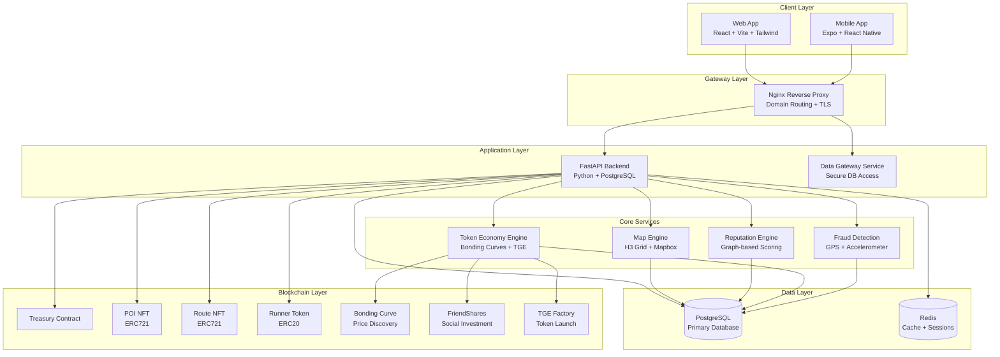
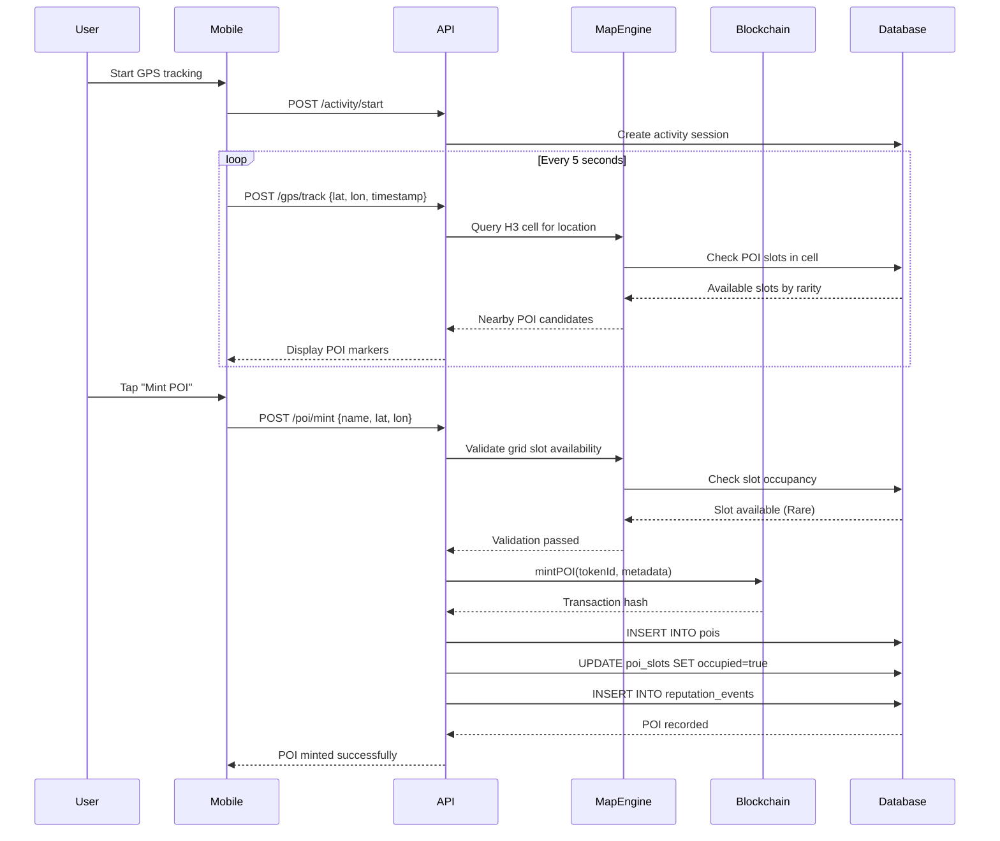
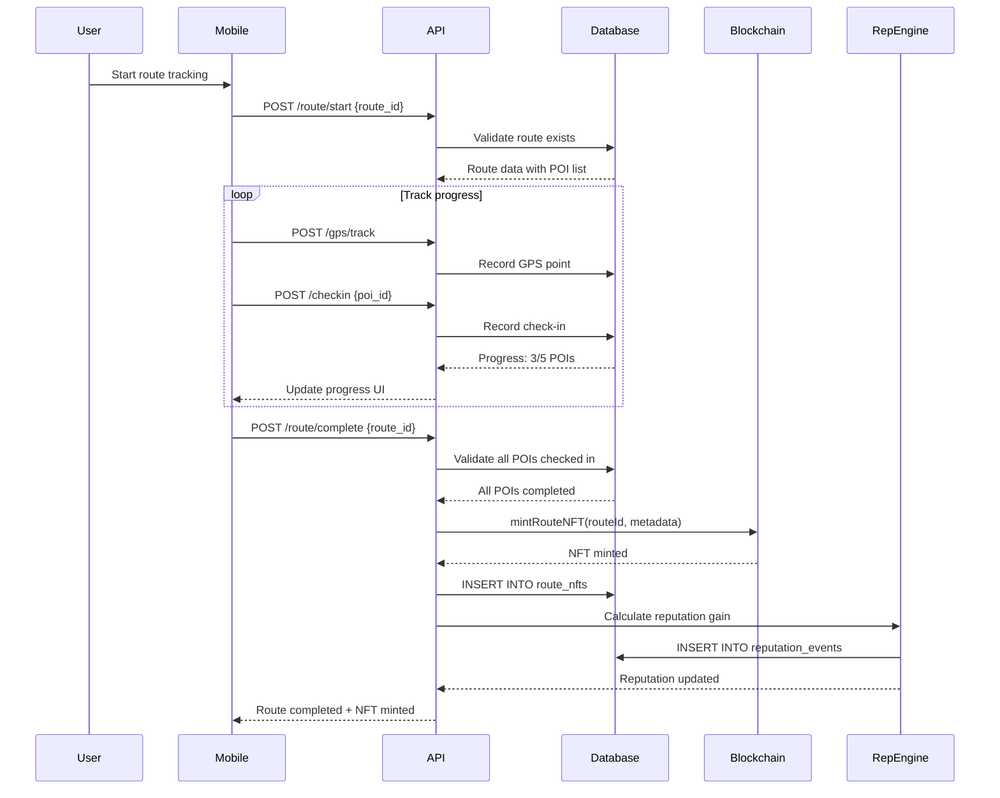
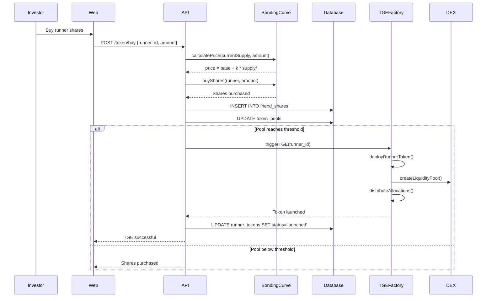

# Design Document: OnTrail Web3 Social-Fi Platform

## Overview

OnTrail is a comprehensive Web3 Social-Fi platform that gamifies outdoor exploration by enabling runners, hikers, and trail explorers to discover real-world Points of Interest (POIs), mint them as NFTs with rarity-based scarcity, complete routes, build reputation, and participate in runner-based token economies. The platform combines geospatial technology (H3 grid system), blockchain (Solidity smart contracts), and social investment mechanics (FriendPass, bonding curves) to create a decentralized ecosystem where physical activity translates into digital value and social capital.

The system architecture follows a monorepo structure with React/Vite web application, Expo mobile app with GPS tracking, FastAPI backend with PostgreSQL and Redis, Solidity smart contracts for POI/Route NFTs and Runner Tokens, and an Nginx gateway managing domain routing across ontrail.tech, app.ontrail.tech, api.ontrail.tech, and wildcard subdomains (*.ontrail.tech) for personalized runner profiles. The platform implements sophisticated anti-cheat mechanisms, reputation algorithms, and token economics to ensure fair play and sustainable growth.

## Architecture



## Sequence Diagrams

### POI Discovery and Minting Flow




### Route Completion and NFT Minting Flow



### Token Economy Flow (Bonding Curve to TGE)



## Components and Interfaces

### Component 1: Map Engine (H3 Grid System)

**Purpose**: Manages global POI scarcity using H3 hexagonal grid system, validates POI slot availability, and enforces rarity distribution rules.

**Interface**:
```typescript
interface MapEngine {
  // Get H3 cell index for coordinates
  getH3Cell(lat: number, lon: number, resolution: number): string;
  
  // Check available POI slots in cell
  getAvailableSlots(h3Index: string): Promise<POISlot[]>;
  
  // Validate POI mint request
  validatePOIMint(lat: number, lon: number, rarity: Rarity): Promise<ValidationResult>;
  
  // Get nearby POIs within radius
  getNearbyPOIs(lat: number, lon: number, radiusKm: number): Promise<POI[]>;
  
  // Initialize grid cell with scarcity rules
  initializeGridCell(h3Index: string, config: GridConfig): Promise<void>;
}

interface POISlot {
  id: string;
  gridId: string;
  rarity: Rarity;
  occupied: boolean;
  poiId?: string;
}

interface GridConfig {
  maxPois: number;
  rarityDistribution: {
    common: number;
    rare: number;
    epic: number;
    legendary: number;
  };
}

type Rarity = 'common' | 'rare' | 'epic' | 'legendary';

interface ValidationResult {
  valid: boolean;
  reason?: string;
  assignedRarity?: Rarity;
}
```

**Responsibilities**:
- Convert GPS coordinates to H3 cell indices
- Enforce POI scarcity rules per grid cell
- Validate POI mint requests against available slots
- Query nearby POIs for discovery
- Manage grid cell initialization and configuration


### Component 2: Reputation Engine

**Purpose**: Calculates and maintains user reputation scores based on POI ownership, route completion, friend network quality, and token economy impact.

**Interface**:
```typescript
interface ReputationEngine {
  // Calculate total reputation for user
  calculateReputation(userId: string): Promise<number>;
  
  // Record reputation event
  recordEvent(event: ReputationEvent): Promise<void>;
  
  // Get reputation breakdown
  getReputationBreakdown(userId: string): Promise<ReputationBreakdown>;
  
  // Update reputation weights (admin only)
  updateWeights(weights: ReputationWeights): Promise<void>;
}

interface ReputationEvent {
  userId: string;
  eventType: 'poi_minted' | 'route_completed' | 'friend_reputation_gain' | 'token_launch';
  weight: number;
  metadata?: Record<string, any>;
}

interface ReputationBreakdown {
  total: number;
  components: {
    poisOwned: number;
    routesCompleted: number;
    friendNetwork: number;
    tokenImpact: number;
  };
}

interface ReputationWeights {
  poiWeight: number;
  routeWeight: number;
  friendWeight: number;
  tokenWeight: number;
}
```

**Responsibilities**:
- Calculate weighted reputation scores
- Track reputation events over time
- Provide reputation breakdowns for transparency
- Support dynamic weight adjustments
- Integrate with friend network graph

### Component 3: Token Economy Engine

**Purpose**: Manages bonding curve mechanics, friend share trading, TGE triggers, and token lifecycle from creation to DEX launch.

**Interface**:
```typescript
interface TokenEconomyEngine {
  // Calculate current price on bonding curve
  calculatePrice(runnerId: string, amount: number): Promise<BigNumber>;
  
  // Buy friend shares
  buyShares(investorId: string, runnerId: string, amount: number): Promise<Transaction>;
  
  // Sell friend shares
  sellShares(investorId: string, runnerId: string, amount: number): Promise<Transaction>;
  
  // Check if TGE threshold reached
  checkTGEThreshold(runnerId: string): Promise<boolean>;
  
  // Trigger Token Generation Event
  triggerTGE(runnerId: string): Promise<TGEResult>;
  
  // Get token pool status
  getPoolStatus(runnerId: string): Promise<PoolStatus>;
}

interface Transaction {
  txHash: string;
  amount: number;
  price: BigNumber;
  timestamp: Date;
}

interface TGEResult {
  tokenAddress: string;
  liquidityPoolAddress: string;
  allocations: {
    runner: number;
    friendPool: number;
    liquidity: number;
    dao: number;
    platform: number;
  };
}

interface PoolStatus {
  currentSupply: number;
  liquidityPool: BigNumber;
  threshold: BigNumber;
  readyForTGE: boolean;
}
```

**Responsibilities**:
- Implement bonding curve price calculation
- Execute share buy/sell transactions
- Monitor TGE threshold conditions
- Deploy runner tokens via TGEFactory
- Distribute token allocations
- Create DEX liquidity pools


### Component 4: Fraud Detection System

**Purpose**: Validates GPS movement patterns, accelerometer data, and step cadence to prevent cheating and ensure authentic physical activity.

**Interface**:
```typescript
interface FraudDetectionSystem {
  // Validate GPS track for anomalies
  validateGPSTrack(sessionId: string, points: GPSPoint[]): Promise<FraudCheckResult>;
  
  // Validate step count against movement
  validateStepCount(sessionId: string, steps: number, distance: number): Promise<FraudCheckResult>;
  
  // Check device attestation
  validateDeviceAttestation(deviceId: string, attestation: string): Promise<boolean>;
  
  // Record fraud event
  recordFraudEvent(event: FraudEvent): Promise<void>;
  
  // Get user fraud score
  getFraudScore(userId: string): Promise<number>;
}

interface GPSPoint {
  latitude: number;
  longitude: number;
  timestamp: Date;
  accuracy: number;
  speed?: number;
}

interface FraudCheckResult {
  valid: boolean;
  confidence: number;
  flags: FraudFlag[];
  reason?: string;
}

type FraudFlag = 
  | 'impossible_speed'
  | 'teleportation'
  | 'gps_spoofing'
  | 'step_mismatch'
  | 'route_discontinuity'
  | 'device_attestation_failed';

interface FraudEvent {
  userId: string;
  sessionId: string;
  eventType: FraudFlag;
  severity: 'low' | 'medium' | 'high' | 'critical';
  metadata: Record<string, any>;
}
```

**Responsibilities**:
- Detect impossible movement speeds
- Identify GPS spoofing attempts
- Validate step count consistency
- Check device attestation signatures
- Maintain fraud score per user
- Flag suspicious activity for review

### Component 5: Backend API Service

**Purpose**: FastAPI backend providing RESTful endpoints for authentication, POI operations, route management, token trading, and admin configuration.

**Interface**:
```python
from fastapi import FastAPI, Depends, HTTPException
from pydantic import BaseModel
from typing import List, Optional

app = FastAPI()

# Authentication endpoints
@app.post("/auth/login")
async def login(credentials: LoginRequest) -> AuthResponse:
    """Authenticate user and return JWT token"""
    pass

@app.post("/auth/register")
async def register(user: RegisterRequest) -> AuthResponse:
    """Register new user account"""
    pass

# User endpoints
@app.get("/users/{user_id}")
async def get_user(user_id: str) -> UserProfile:
    """Get user profile by ID"""
    pass

@app.get("/runner/{username}")
async def get_runner_profile(username: str) -> RunnerProfile:
    """Get runner profile by username (subdomain routing)"""
    pass

# POI endpoints
@app.get("/poi/nearby")
async def get_nearby_pois(lat: float, lon: float, radius_km: float) -> List[POI]:
    """Get POIs within radius of coordinates"""
    pass

@app.post("/poi/mint")
async def mint_poi(request: MintPOIRequest, user=Depends(get_current_user)) -> POI:
    """Mint new POI NFT"""
    pass

# Route endpoints
@app.post("/route/start")
async def start_route(request: StartRouteRequest, user=Depends(get_current_user)) -> RouteSession:
    """Start route tracking session"""
    pass

@app.post("/route/complete")
async def complete_route(request: CompleteRouteRequest, user=Depends(get_current_user)) -> RouteNFT:
    """Complete route and mint NFT"""
    pass

# Check-in endpoints
@app.post("/checkin")
async def checkin_poi(request: CheckinRequest, user=Depends(get_current_user)) -> Checkin:
    """Check in at POI location"""
    pass

# Token endpoints
@app.post("/token/buy")
async def buy_shares(request: BuySharesRequest, user=Depends(get_current_user)) -> Transaction:
    """Buy runner shares on bonding curve"""
    pass

@app.post("/token/sell")
async def sell_shares(request: SellSharesRequest, user=Depends(get_current_user)) -> Transaction:
    """Sell runner shares"""
    pass

@app.get("/token/price/{runner_id}")
async def get_token_price(runner_id: str, amount: int) -> PriceQuote:
    """Get current price quote for shares"""
    pass

# Admin endpoints
@app.post("/admin/config")
async def update_config(config: AdminConfig, user=Depends(require_admin)) -> ConfigResponse:
    """Update system configuration"""
    pass

@app.post("/admin/simulate")
async def run_simulation(params: SimulationParams, user=Depends(require_admin)) -> SimulationResult:
    """Run token economy simulation"""
    pass
```

**Responsibilities**:
- Handle HTTP requests and responses
- Authenticate and authorize users
- Validate request payloads
- Coordinate between services (Map Engine, Reputation, Token Economy)
- Interact with blockchain contracts
- Manage database transactions
- Return appropriate error responses


## Data Models

### Model 1: User

```typescript
interface User {
  id: string;
  username: string;
  email: string;
  walletAddress: string;
  reputationScore: number;
  createdAt: Date;
  updatedAt: Date;
}
```

**Validation Rules**:
- `username` must be unique, 3-20 characters, alphanumeric with underscores
- `email` must be valid email format
- `walletAddress` must be valid Ethereum address (0x + 40 hex chars)
- `reputationScore` must be non-negative number

### Model 2: POI (Point of Interest)

```typescript
interface POI {
  id: string;
  name: string;
  description?: string;
  latitude: number;
  longitude: number;
  rarity: 'common' | 'rare' | 'epic' | 'legendary';
  ownerId: string;
  gridId: string;
  nftTokenId?: string;
  nftContractAddress?: string;
  mintedAt: Date;
  metadata: POIMetadata;
}

interface POIMetadata {
  photos?: string[];
  tags?: string[];
  category?: string;
  elevation?: number;
}
```

**Validation Rules**:
- `name` must be 3-100 characters
- `latitude` must be between -90 and 90
- `longitude` must be between -180 and 180
- `rarity` must match available slot in grid cell
- `gridId` must reference existing grid_cell
- `ownerId` must reference existing user

### Model 3: Route

```typescript
interface Route {
  id: string;
  name: string;
  description?: string;
  creatorId: string;
  difficulty: 'easy' | 'moderate' | 'hard' | 'expert';
  distanceKm: number;
  elevationGainM?: number;
  estimatedDurationMin: number;
  poiIds: string[];
  createdAt: Date;
  completionCount: number;
}
```

**Validation Rules**:
- `name` must be 3-100 characters
- `distanceKm` must be positive number
- `poiIds` must contain at least 2 POIs
- All POIs in `poiIds` must exist in database
- `difficulty` must be one of allowed values

### Model 4: GridCell

```typescript
interface GridCell {
  id: string;
  h3Index: string;
  resolution: number;
  maxPois: number;
  rarityDistribution: {
    common: number;
    rare: number;
    epic: number;
    legendary: number;
  };
  currentPoisCount: number;
  createdAt: Date;
}
```

**Validation Rules**:
- `h3Index` must be valid H3 cell index
- `resolution` must be between 0 and 15
- Sum of `rarityDistribution` values must equal `maxPois`
- `currentPoisCount` must not exceed `maxPois`

### Model 5: RunnerToken

```typescript
interface RunnerToken {
  id: string;
  runnerId: string;
  tokenName: string;
  tokenSymbol: string;
  contractAddress?: string;
  totalSupply: number;
  bondingCurvePool: string; // BigNumber as string
  status: 'bonding_curve' | 'tge_ready' | 'launched';
  tgeDate?: Date;
  createdAt: Date;
}
```

**Validation Rules**:
- `runnerId` must reference existing user
- `tokenSymbol` must be 3-5 uppercase characters
- `totalSupply` must be positive
- `status` transitions: bonding_curve → tge_ready → launched
- `contractAddress` required when status is 'launched'

### Model 6: FriendShare

```typescript
interface FriendShare {
  id: string;
  ownerId: string;
  runnerId: string;
  amount: number;
  purchasePrice: string; // BigNumber as string
  purchasedAt: Date;
}
```

**Validation Rules**:
- `ownerId` and `runnerId` must reference existing users
- `ownerId` cannot equal `runnerId` (cannot buy own shares)
- `amount` must be positive
- `purchasePrice` must be positive

## Algorithmic Pseudocode

### Main POI Minting Algorithm

```typescript
async function mintPOI(
  userId: string,
  name: string,
  latitude: number,
  longitude: number
): Promise<POI> {
  // Preconditions:
  // - User exists and is authenticated
  // - Coordinates are valid GPS coordinates
  // - Name is non-empty string
  
  // Step 1: Get H3 cell for location
  const h3Index = mapEngine.getH3Cell(latitude, longitude, RESOLUTION);
  
  // Step 2: Get or create grid cell
  let gridCell = await database.getGridCell(h3Index);
  if (!gridCell) {
    gridCell = await mapEngine.initializeGridCell(h3Index, DEFAULT_GRID_CONFIG);
  }
  
  // Step 3: Check available slots
  const availableSlots = await database.getAvailableSlots(gridCell.id);
  if (availableSlots.length === 0) {
    throw new Error('No available POI slots in this grid cell');
  }
  
  // Step 4: Assign rarity based on available slots
  const slot = availableSlots[0]; // Take first available slot
  const rarity = slot.rarity;
  
  // Step 5: Mint NFT on blockchain
  const nftResult = await blockchain.mintPOINFT({
    name,
    latitude,
    longitude,
    rarity,
    owner: userId
  });
  
  // Step 6: Record POI in database
  const poi = await database.createPOI({
    name,
    latitude,
    longitude,
    rarity,
    ownerId: userId,
    gridId: gridCell.id,
    nftTokenId: nftResult.tokenId,
    nftContractAddress: nftResult.contractAddress,
    mintedAt: new Date()
  });
  
  // Step 7: Mark slot as occupied
  await database.updatePOISlot(slot.id, { occupied: true, poiId: poi.id });
  
  // Step 8: Record reputation event
  await reputationEngine.recordEvent({
    userId,
    eventType: 'poi_minted',
    weight: RARITY_WEIGHTS[rarity],
    metadata: { poiId: poi.id, rarity }
  });
  
  // Postconditions:
  // - POI exists in database
  // - NFT minted on blockchain
  // - Grid slot marked as occupied
  // - Reputation event recorded
  
  return poi;
}
```

**Preconditions**:
- User is authenticated and exists in database
- `latitude` ∈ [-90, 90] and `longitude` ∈ [-180, 180]
- `name` is non-empty string with length ≤ 100

**Postconditions**:
- POI record created in database with valid NFT reference
- Exactly one POI slot marked as occupied in grid cell
- Reputation event recorded for user
- NFT minted on blockchain with correct metadata

**Loop Invariants**: N/A (no loops in main algorithm)


### Bonding Curve Price Calculation Algorithm

```typescript
function calculateBondingCurvePrice(
  currentSupply: number,
  amount: number,
  basePrice: number,
  k: number
): number {
  // Preconditions:
  // - currentSupply ≥ 0
  // - amount > 0
  // - basePrice > 0
  // - k > 0
  
  // Formula: price = base + k * supply²
  // For buying 'amount' shares, integrate over supply range
  
  let totalCost = 0;
  
  // Loop invariant: totalCost represents accurate cost for shares [0, i)
  for (let i = 0; i < amount; i++) {
    const supply = currentSupply + i;
    const price = basePrice + k * (supply ** 2);
    totalCost += price;
  }
  
  // Postconditions:
  // - totalCost > 0
  // - totalCost represents sum of prices for each share
  
  return totalCost;
}
```

**Preconditions**:
- `currentSupply` ≥ 0 (non-negative integer)
- `amount` > 0 (positive integer)
- `basePrice` > 0 (positive number)
- `k` > 0 (positive number, curve steepness factor)

**Postconditions**:
- Returns positive number representing total cost
- Cost increases with supply (monotonically increasing)
- For amount = 1, returns basePrice + k * currentSupply²

**Loop Invariants**:
- At iteration i: `totalCost` = Σ(basePrice + k * (currentSupply + j)²) for j ∈ [0, i)
- `supply` = currentSupply + i
- `price` > 0 for all iterations

### Reputation Calculation Algorithm

```typescript
async function calculateReputation(userId: string): Promise<number> {
  // Preconditions:
  // - User exists in database
  // - Reputation weights are configured
  
  // Step 1: Get reputation weights
  const weights = await database.getReputationWeights();
  
  // Step 2: Count POIs owned by user
  const poisCount = await database.countPOIsByOwner(userId);
  const poiScore = poisCount * weights.poiWeight;
  
  // Step 3: Count routes completed
  const routesCount = await database.countRoutesCompleted(userId);
  const routeScore = routesCount * weights.routeWeight;
  
  // Step 4: Calculate friend network reputation
  const friends = await database.getFriends(userId);
  let friendScore = 0;
  
  // Loop invariant: friendScore = sum of (friend reputation * weight) for processed friends
  for (const friend of friends) {
    const friendReputation = await database.getUserReputation(friend.id);
    friendScore += friendReputation * weights.friendWeight;
  }
  
  // Step 5: Calculate token impact
  const tokens = await database.getRunnerTokens(userId);
  let tokenScore = 0;
  
  // Loop invariant: tokenScore = sum of token impacts for processed tokens
  for (const token of tokens) {
    if (token.status === 'launched') {
      const marketCap = await blockchain.getTokenMarketCap(token.contractAddress);
      tokenScore += marketCap * weights.tokenWeight;
    }
  }
  
  // Step 6: Sum all components
  const totalReputation = poiScore + routeScore + friendScore + tokenScore;
  
  // Postconditions:
  // - totalReputation ≥ 0
  // - totalReputation is weighted sum of all components
  
  return totalReputation;
}
```

**Preconditions**:
- `userId` references existing user in database
- Reputation weights are configured and positive
- All referenced entities (POIs, routes, friends, tokens) are valid

**Postconditions**:
- Returns non-negative number
- Reputation = (POIs × poiWeight) + (Routes × routeWeight) + (FriendRep × friendWeight) + (TokenImpact × tokenWeight)
- Result is deterministic for given user state

**Loop Invariants**:
- Friend loop: `friendScore` = Σ(friend[i].reputation × friendWeight) for i ∈ [0, current)
- Token loop: `tokenScore` = Σ(token[i].marketCap × tokenWeight) for i ∈ [0, current) where token[i].status = 'launched'

### GPS Track Validation Algorithm

```typescript
function validateGPSTrack(points: GPSPoint[]): FraudCheckResult {
  // Preconditions:
  // - points array is non-empty
  // - points are sorted by timestamp
  // - each point has valid coordinates
  
  const flags: FraudFlag[] = [];
  const MAX_SPEED_KMH = 30; // Maximum realistic running speed
  const MAX_ACCURACY_M = 50; // Maximum acceptable GPS accuracy
  
  // Loop invariant: flags contains all detected anomalies for points [0, i)
  for (let i = 1; i < points.length; i++) {
    const prev = points[i - 1];
    const curr = points[i];
    
    // Check time difference
    const timeDiffSec = (curr.timestamp.getTime() - prev.timestamp.getTime()) / 1000;
    if (timeDiffSec <= 0) {
      flags.push('route_discontinuity');
      continue;
    }
    
    // Calculate distance between points
    const distanceKm = haversineDistance(
      prev.latitude, prev.longitude,
      curr.latitude, curr.longitude
    );
    
    // Calculate speed
    const speedKmh = (distanceKm / timeDiffSec) * 3600;
    
    // Check for impossible speed
    if (speedKmh > MAX_SPEED_KMH) {
      flags.push('impossible_speed');
    }
    
    // Check for teleportation (large distance in short time)
    if (distanceKm > 1 && timeDiffSec < 10) {
      flags.push('teleportation');
    }
    
    // Check GPS accuracy
    if (curr.accuracy > MAX_ACCURACY_M) {
      flags.push('gps_spoofing');
    }
  }
  
  // Calculate confidence score
  const confidence = Math.max(0, 1 - (flags.length / points.length));
  
  // Postconditions:
  // - flags contains all detected anomalies
  // - confidence ∈ [0, 1]
  // - valid = true if no critical flags detected
  
  return {
    valid: flags.length === 0,
    confidence,
    flags: [...new Set(flags)], // Remove duplicates
    reason: flags.length > 0 ? `Detected ${flags.length} anomalies` : undefined
  };
}

function haversineDistance(lat1: number, lon1: number, lat2: number, lon2: number): number {
  const R = 6371; // Earth radius in km
  const dLat = toRadians(lat2 - lat1);
  const dLon = toRadians(lon2 - lon1);
  
  const a = Math.sin(dLat / 2) ** 2 +
            Math.cos(toRadians(lat1)) * Math.cos(toRadians(lat2)) *
            Math.sin(dLon / 2) ** 2;
  
  const c = 2 * Math.atan2(Math.sqrt(a), Math.sqrt(1 - a));
  return R * c;
}

function toRadians(degrees: number): number {
  return degrees * (Math.PI / 180);
}
```

**Preconditions**:
- `points.length` > 0
- Points are sorted chronologically by timestamp
- All coordinates are valid: lat ∈ [-90, 90], lon ∈ [-180, 180]

**Postconditions**:
- Returns FraudCheckResult with validation status
- `confidence` ∈ [0, 1] where 1 = no anomalies detected
- `flags` contains unique fraud indicators
- `valid` = true ⟺ flags.length = 0

**Loop Invariants**:
- At iteration i: `flags` contains all anomalies detected in points[0..i]
- Each point pair (prev, curr) is validated exactly once
- Distance and speed calculations use haversine formula for accuracy


### TGE (Token Generation Event) Trigger Algorithm

```typescript
async function triggerTGE(runnerId: string): Promise<TGEResult> {
  // Preconditions:
  // - Runner exists and has active bonding curve
  // - Bonding curve pool has reached threshold
  // - No existing launched token for runner
  
  // Step 1: Validate TGE eligibility
  const runnerToken = await database.getRunnerToken(runnerId);
  if (!runnerToken || runnerToken.status !== 'tge_ready') {
    throw new Error('Runner not eligible for TGE');
  }
  
  const poolStatus = await tokenEconomy.getPoolStatus(runnerId);
  if (!poolStatus.readyForTGE) {
    throw new Error('Pool threshold not reached');
  }
  
  // Step 2: Deploy ERC20 token contract
  const tokenContract = await blockchain.deployRunnerToken({
    name: runnerToken.tokenName,
    symbol: runnerToken.tokenSymbol,
    totalSupply: TOTAL_SUPPLY
  });
  
  // Step 3: Calculate allocations
  const allocations = {
    runner: TOTAL_SUPPLY * 0.35,      // 35% to runner
    friendPool: TOTAL_SUPPLY * 0.20,  // 20% to friend share holders
    liquidity: TOTAL_SUPPLY * 0.25,   // 25% to DEX liquidity
    dao: TOTAL_SUPPLY * 0.10,         // 10% to DAO treasury
    platform: TOTAL_SUPPLY * 0.10     // 10% to platform
  };
  
  // Step 4: Distribute tokens to runner
  await blockchain.transfer(tokenContract.address, runnerToken.runnerId, allocations.runner);
  
  // Step 5: Distribute to friend share holders
  const friendShares = await database.getFriendShares(runnerId);
  const totalShares = friendShares.reduce((sum, share) => sum + share.amount, 0);
  
  // Loop invariant: All processed friends have received proportional allocation
  for (const share of friendShares) {
    const proportion = share.amount / totalShares;
    const allocation = allocations.friendPool * proportion;
    await blockchain.transfer(tokenContract.address, share.ownerId, allocation);
  }
  
  // Step 6: Create DEX liquidity pool
  const liquidityPool = await blockchain.createLiquidityPool({
    tokenAddress: tokenContract.address,
    tokenAmount: allocations.liquidity,
    ethAmount: poolStatus.liquidityPool
  });
  
  // Step 7: Transfer to DAO and platform
  await blockchain.transfer(tokenContract.address, DAO_ADDRESS, allocations.dao);
  await blockchain.transfer(tokenContract.address, PLATFORM_ADDRESS, allocations.platform);
  
  // Step 8: Update database
  await database.updateRunnerToken(runnerToken.id, {
    contractAddress: tokenContract.address,
    status: 'launched',
    tgeDate: new Date()
  });
  
  // Step 9: Record reputation event
  await reputationEngine.recordEvent({
    userId: runnerId,
    eventType: 'token_launch',
    weight: TOKEN_LAUNCH_WEIGHT,
    metadata: { tokenAddress: tokenContract.address }
  });
  
  // Postconditions:
  // - Token contract deployed and verified
  // - All allocations distributed correctly
  // - Liquidity pool created and funded
  // - Database updated with contract address
  // - Reputation event recorded
  
  return {
    tokenAddress: tokenContract.address,
    liquidityPoolAddress: liquidityPool.address,
    allocations
  };
}
```

**Preconditions**:
- Runner has active bonding curve with status 'tge_ready'
- Bonding curve pool ≥ threshold amount
- No existing token with status 'launched' for runner
- All friend share holders have valid wallet addresses

**Postconditions**:
- ERC20 token deployed with correct name, symbol, and supply
- Allocations sum to TOTAL_SUPPLY (100%)
- Each friend share holder receives proportional allocation
- Liquidity pool created with correct token and ETH amounts
- Runner token status updated to 'launched'
- Token launch reputation event recorded

**Loop Invariants**:
- Friend distribution loop: Σ(allocated tokens) ≤ allocations.friendPool
- Each friend receives: (share.amount / totalShares) × allocations.friendPool tokens
- All transfers succeed or entire transaction reverts

## Key Functions with Formal Specifications

### Function 1: getAvailableSlots()

```typescript
async function getAvailableSlots(gridId: string): Promise<POISlot[]>
```

**Preconditions:**
- `gridId` references existing grid_cell in database
- Grid cell has been initialized with rarity distribution

**Postconditions:**
- Returns array of POISlot objects where `occupied = false`
- Slots are ordered by rarity (legendary → epic → rare → common)
- Array length ≤ grid_cell.maxPois
- All returned slots belong to specified grid cell

**Loop Invariants:** N/A (database query, no explicit loops)

### Function 2: buyShares()

```typescript
async function buyShares(
  investorId: string,
  runnerId: string,
  amount: number
): Promise<Transaction>
```

**Preconditions:**
- `investorId` and `runnerId` reference existing users
- `investorId` ≠ `runnerId` (cannot buy own shares)
- `amount` > 0
- Investor has sufficient balance for purchase
- Runner token status is 'bonding_curve' or 'tge_ready'

**Postconditions:**
- Friend share record created with correct amount and price
- Investor balance decreased by total cost
- Bonding curve pool increased by total cost
- Token pool supply increased by amount
- Transaction record created with hash and timestamp
- If pool reaches threshold, status updated to 'tge_ready'

**Loop Invariants:** N/A (atomic transaction)

### Function 3: completeRoute()

```typescript
async function completeRoute(
  userId: string,
  routeId: string,
  checkins: string[]
): Promise<RouteNFT>
```

**Preconditions:**
- User is authenticated and exists
- Route exists in database
- `checkins` contains all POI IDs from route
- All check-ins have valid timestamps within session
- Check-ins are in correct order (matching route sequence)

**Postconditions:**
- Route NFT minted on blockchain
- route_nfts record created in database
- Route completion count incremented
- Reputation event recorded for user
- All check-ins validated and recorded

**Loop Invariants:**
- Check-in validation loop: All processed check-ins match route POIs
- Each POI in route checked exactly once

## Example Usage

### Example 1: Minting a POI

```typescript
// User discovers a mountain summit
const user = await authenticateUser(walletAddress);

// Check nearby POIs first
const nearbyPOIs = await api.get('/poi/nearby', {
  params: { lat: 47.6062, lon: -122.3321, radius_km: 1 }
});

// Mint new POI
const poi = await api.post('/poi/mint', {
  name: 'Kerry Park Viewpoint',
  latitude: 47.6295,
  longitude: -122.3598,
  description: 'Iconic Seattle skyline view'
});

console.log(`POI minted with rarity: ${poi.rarity}`);
console.log(`NFT Token ID: ${poi.nftTokenId}`);
```

### Example 2: Completing a Route

```typescript
// Start route tracking
const session = await api.post('/route/start', {
  routeId: 'route-123'
});

// Track GPS and check in at POIs
const checkins = [];
for (const poi of route.pois) {
  // User arrives at POI location
  const checkin = await api.post('/checkin', {
    poiId: poi.id,
    latitude: poi.latitude,
    longitude: poi.longitude
  });
  checkins.push(checkin.id);
}

// Complete route and mint NFT
const routeNFT = await api.post('/route/complete', {
  routeId: 'route-123',
  checkins
});

console.log(`Route completed! NFT: ${routeNFT.nftTokenId}`);
```

### Example 3: Buying Runner Shares

```typescript
// Get current price quote
const quote = await api.get('/token/price/runner-456', {
  params: { amount: 10 }
});

console.log(`Price for 10 shares: ${quote.totalCost} ETH`);
console.log(`Current supply: ${quote.currentSupply}`);

// Buy shares on bonding curve
const transaction = await api.post('/token/buy', {
  runnerId: 'runner-456',
  amount: 10
});

console.log(`Shares purchased! TX: ${transaction.txHash}`);

// Check if TGE threshold reached
const poolStatus = await api.get('/token/pool/runner-456');
if (poolStatus.readyForTGE) {
  console.log('Runner is ready for Token Generation Event!');
}
```

### Example 4: Admin Token Simulation

```typescript
// Run bonding curve simulation
const simulation = await api.post('/admin/simulate', {
  simulationName: 'High Growth Scenario',
  parameters: {
    basePrice: 0.01,
    k: 0.000002,
    investorCount: 100,
    avgInvestment: 50,
    tgeThreshold: 10000
  }
});

console.log('Simulation Results:');
console.log(`Final supply: ${simulation.results.finalSupply}`);
console.log(`Pool size: ${simulation.results.poolSize} ETH`);
console.log(`TGE triggered: ${simulation.results.tgeTriggered}`);
console.log(`Price at TGE: ${simulation.results.finalPrice} ETH`);
```


## Correctness Properties

*A property is a characteristic or behavior that should hold true across all valid executions of a system—essentially, a formal statement about what the system should do. Properties serve as the bridge between human-readable specifications and machine-verifiable correctness guarantees.*

### Property 1: POI Scarcity Invariant

*For any* grid cell, the total number of POIs minted in that cell never exceeds the maximum allowed, and the count of POIs for each rarity level never exceeds the configured distribution for that rarity.

**Validates: Requirements 3.2, 4.4**

### Property 2: Bonding Curve Monotonicity

*For any* current supply and positive amount, the price per share at supply + amount is always greater than the price per share at the current supply.

**Validates: Requirements 9.3**

### Property 3: Token Allocation Conservation

*For any* Token Generation Event, the sum of all allocations (runner + friend pool + liquidity + DAO + platform) equals exactly 100% of the total token supply.

**Validates: Requirements 11.10**

### Property 4: Reputation Non-Negativity

*For any* user, their calculated reputation score is always greater than or equal to zero.

**Validates: Requirements 8.6**

### Property 5: GPS Track Continuity and Speed Validation

*For any* GPS track with consecutive points, all timestamps are in chronological order and the calculated speed between any two consecutive points does not exceed the maximum realistic running speed of 30 km/h.

**Validates: Requirements 7.1, 7.3**

### Property 6: Friend Share Self-Purchase Prevention

*For any* runner and investor pair, the investor can buy shares of the runner if and only if the investor ID is different from the runner ID.

**Validates: Requirements 10.1, 10.2**

### Property 7: Route Completion Validity

*For any* route and completion attempt, the completion is valid if and only if there exists exactly one check-in for each POI in the route.

**Validates: Requirements 6.4**

### Property 8: NFT Ownership Uniqueness

**Universal Quantification:**
```
∀ POI NFT n:
  ∃! user u: ownerOf(n.tokenId) = u.walletAddress
```

**Description**: Every POI NFT has exactly one owner at any given time.

**Test Strategy**: Verify blockchain ownerOf() returns unique address for each token.

## Error Handling

### Error Scenario 1: Grid Cell POI Limit Reached

**Condition**: User attempts to mint POI in grid cell where all slots are occupied

**Response**: 
- API returns 409 Conflict status
- Error message: "No available POI slots in this grid cell"
- Suggest nearby cells with available slots

**Recovery**: 
- User can move to different location
- System suggests alternative nearby locations with available slots

### Error Scenario 2: Insufficient Balance for Share Purchase

**Condition**: User attempts to buy shares but has insufficient ETH balance

**Response**:
- Transaction reverts on blockchain
- API returns 402 Payment Required status
- Error message: "Insufficient balance. Required: X ETH, Available: Y ETH"

**Recovery**:
- User adds funds to wallet
- System displays required amount clearly

### Error Scenario 3: GPS Spoofing Detected

**Condition**: Fraud detection identifies impossible movement patterns

**Response**:
- Activity session flagged as suspicious
- POI mint or route completion rejected
- Fraud event recorded in database
- User fraud score increased

**Recovery**:
- User can appeal with evidence
- Admin reviews fraud event
- Legitimate users can have flags removed

### Error Scenario 4: Route Completion with Missing Check-ins

**Condition**: User attempts to complete route without checking in at all POIs

**Response**:
- API returns 400 Bad Request status
- Error message: "Incomplete route. Missing check-ins: [POI names]"
- Display which POIs still need to be visited

**Recovery**:
- User returns to missing POI locations
- Complete check-ins
- Retry route completion

### Error Scenario 5: TGE Triggered Before Threshold

**Condition**: Attempt to trigger TGE when bonding curve pool below threshold

**Response**:
- API returns 403 Forbidden status
- Error message: "TGE threshold not reached. Current: X ETH, Required: Y ETH"
- Display progress toward threshold

**Recovery**:
- Wait for more investors to buy shares
- System automatically triggers TGE when threshold reached

### Error Scenario 6: Duplicate POI Name in Grid Cell

**Condition**: User attempts to mint POI with name already used in same grid cell

**Response**:
- API returns 409 Conflict status
- Error message: "POI name already exists in this area"
- Suggest alternative names

**Recovery**:
- User chooses different name
- System validates uniqueness within grid cell

### Error Scenario 7: Smart Contract Transaction Failure

**Condition**: Blockchain transaction fails or reverts

**Response**:
- Catch transaction error
- Rollback database changes
- API returns 500 Internal Server Error
- Error message: "Blockchain transaction failed: [reason]"
- Log transaction hash for debugging

**Recovery**:
- Retry transaction with higher gas
- Check contract state
- Admin investigates if persistent

## Testing Strategy

### Unit Testing Approach

**Framework**: Vitest

**Coverage Goals**: 
- 90%+ code coverage for core business logic
- 100% coverage for critical paths (POI minting, token transactions, reputation calculation)

**Key Test Suites**:

1. **Map Engine Tests** (`mapEngine.test.ts`)
   - H3 cell index generation
   - Grid cell initialization
   - POI slot availability checks
   - Rarity distribution enforcement

2. **Reputation Engine Tests** (`reputationEngine.test.ts`)
   - Reputation calculation with various inputs
   - Weight adjustment effects
   - Event recording and aggregation
   - Friend network reputation propagation

3. **Token Economy Tests** (`tokenEconomy.test.ts`)
   - Bonding curve price calculations
   - Share buy/sell transactions
   - TGE threshold detection
   - Allocation distribution

4. **Fraud Detection Tests** (`fraudDetection.test.ts`)
   - GPS track validation
   - Speed anomaly detection
   - Teleportation detection
   - Step count validation

5. **API Endpoint Tests** (`api.test.ts`)
   - Request validation
   - Authentication/authorization
   - Error handling
   - Response formatting

### Property-Based Testing Approach

**Framework**: fast-check (TypeScript)

**Property Test Library**: fast-check

**Key Properties to Test**:

1. **Bonding Curve Properties**
   - Monotonicity: price always increases with supply
   - Reversibility: buy then sell returns to original state (minus fees)
   - Commutativity: order of purchases doesn't affect final price

2. **POI Grid Properties**
   - Scarcity invariant: never exceed max POIs per cell
   - Rarity distribution: counts match configuration
   - Uniqueness: no duplicate POI IDs

3. **Reputation Properties**
   - Non-negativity: reputation always ≥ 0
   - Monotonicity: adding positive events increases reputation
   - Determinism: same inputs produce same output

4. **GPS Validation Properties**
   - Valid tracks always pass validation
   - Impossible speeds always detected
   - Chronological ordering enforced

**Example Property Test**:
```typescript
import fc from 'fast-check';

describe('Bonding Curve Properties', () => {
  it('price increases monotonically with supply', () => {
    fc.assert(
      fc.property(
        fc.nat(10000), // current supply
        fc.constant(0.01), // base price
        fc.constant(0.000002), // k factor
        (supply, base, k) => {
          const price1 = calculatePrice(supply, 1, base, k);
          const price2 = calculatePrice(supply + 1, 1, base, k);
          return price2 > price1;
        }
      )
    );
  });
});
```

### Integration Testing Approach

**Scope**: Test interactions between components

**Key Integration Tests**:

1. **POI Minting Flow**
   - API → Map Engine → Database → Blockchain
   - Verify end-to-end POI creation
   - Validate NFT minting and database consistency

2. **Route Completion Flow**
   - Mobile → API → Database → Blockchain → Reputation Engine
   - Verify check-ins, NFT minting, reputation updates

3. **Token Purchase Flow**
   - Web → API → Token Economy → Blockchain → Database
   - Verify price calculation, transaction execution, balance updates

4. **TGE Trigger Flow**
   - API → Token Economy → Blockchain (multiple contracts)
   - Verify token deployment, allocation distribution, liquidity pool creation

**Test Environment**:
- Local blockchain (Hardhat network)
- Test database (PostgreSQL with test data)
- Mock external services (Mapbox, etc.)

## Performance Considerations

### Database Optimization

**Indexing Strategy**:
- Index on `users.wallet_address` for fast authentication lookups
- Composite index on `pois(grid_id, rarity)` for slot availability queries
- Index on `gps_points(session_id, timestamp)` for track validation
- Index on `friend_shares(runner_id, owner_id)` for share lookups

**Query Optimization**:
- Use connection pooling (pg-pool) with 20-50 connections
- Implement read replicas for heavy read operations
- Cache frequently accessed data in Redis (grid configs, reputation weights)
- Use prepared statements for repeated queries

**Expected Performance**:
- POI nearby query: < 100ms
- Reputation calculation: < 200ms
- Token price calculation: < 50ms
- GPS track validation: < 500ms for 1000 points

### Caching Strategy

**Redis Cache Usage**:
- User sessions (TTL: 24 hours)
- Grid cell configurations (TTL: 1 hour)
- Reputation weights (TTL: 1 hour)
- Token prices (TTL: 30 seconds)
- Nearby POI results (TTL: 5 minutes)

**Cache Invalidation**:
- Invalidate on write operations
- Use cache-aside pattern
- Implement cache warming for popular data

### Blockchain Optimization

**Gas Optimization**:
- Batch NFT mints when possible
- Use efficient data structures in contracts
- Minimize storage writes
- Use events for off-chain data

**Transaction Management**:
- Queue transactions during high gas periods
- Implement retry logic with exponential backoff
- Monitor gas prices and adjust dynamically

## Security Considerations

### Authentication & Authorization

**JWT Token Security**:
- Use RS256 algorithm (asymmetric)
- Short expiration (1 hour access token, 7 days refresh token)
- Store refresh tokens in httpOnly cookies
- Implement token rotation

**Wallet Authentication**:
- Sign challenge message with private key
- Verify signature on backend
- Prevent replay attacks with nonces
- Rate limit authentication attempts

### Smart Contract Security

**Security Measures**:
- Use OpenZeppelin audited contracts
- Implement reentrancy guards
- Add pausability for emergency stops
- Use SafeMath for arithmetic operations
- Implement access control (Ownable, AccessControl)

**Audit Requirements**:
- Professional smart contract audit before mainnet
- Bug bounty program
- Testnet deployment and testing period

### API Security

**Rate Limiting**:
- 100 requests per minute per IP
- 1000 requests per hour per user
- Stricter limits on expensive operations (POI mint: 10/hour)

**Input Validation**:
- Validate all user inputs
- Sanitize strings to prevent injection
- Verify GPS coordinates are within valid ranges
- Check file uploads for malicious content

**CORS Configuration**:
- Whitelist allowed origins
- Restrict to HTTPS in production
- Validate Origin header

### Data Privacy

**PII Protection**:
- Hash email addresses
- Encrypt sensitive data at rest
- Use HTTPS for all communications
- Implement GDPR compliance (right to deletion)

**Location Privacy**:
- Don't store exact GPS tracks permanently
- Aggregate location data for analytics
- Allow users to opt out of location sharing
- Implement location fuzzing for public display

## Dependencies

### Frontend Dependencies (React/Vite)
- `react` ^18.2.0 - UI framework
- `vite` ^5.0.0 - Build tool
- `tailwindcss` ^3.4.0 - Styling
- `i18next` ^23.0.0 - Internationalization
- `wagmi` ^2.0.0 - Web3 React hooks
- `ethers` ^6.0.0 - Ethereum library
- `react-router-dom` ^6.20.0 - Routing
- `@tanstack/react-query` ^5.0.0 - Data fetching

### Mobile Dependencies (Expo)
- `expo` ^50.0.0 - Mobile framework
- `react-native` ^0.73.0 - Native components
- `expo-location` ^16.0.0 - GPS tracking
- `expo-sensors` ^13.0.0 - Accelerometer
- `@react-navigation/native` ^6.1.0 - Navigation

### Backend Dependencies (Python/FastAPI)
- `fastapi` ^0.109.0 - Web framework
- `uvicorn` ^0.27.0 - ASGI server
- `sqlalchemy` ^2.0.0 - ORM
- `psycopg2-binary` ^2.9.0 - PostgreSQL driver
- `redis` ^5.0.0 - Redis client
- `h3` ^3.7.0 - H3 grid library
- `pydantic` ^2.5.0 - Data validation
- `python-jose` ^3.3.0 - JWT handling
- `web3` ^6.0.0 - Ethereum library

### Smart Contract Dependencies (Solidity)
- `@openzeppelin/contracts` ^5.0.0 - Contract libraries
- `hardhat` ^2.19.0 - Development environment
- `@nomicfoundation/hardhat-toolbox` ^4.0.0 - Hardhat plugins
- `ethers` ^6.0.0 - Ethereum library

### Infrastructure Dependencies
- PostgreSQL 15+ - Primary database
- Redis 7+ - Cache and sessions
- Nginx 1.24+ - Reverse proxy
- Node.js 20+ - JavaScript runtime
- Python 3.11+ - Backend runtime
- PM2 5+ - Process manager

### External Services
- Mapbox API - Map tiles and geocoding
- Ethereum RPC - Blockchain interaction (Infura/Alchemy)
- IPFS - NFT metadata storage (optional)

---

## Implementation Notes

This design document provides a comprehensive blueprint for building the OnTrail platform. Key implementation priorities:

1. **Phase 1**: Repository structure, infrastructure setup, database schema
2. **Phase 2**: Backend API with core endpoints, Map Engine integration
3. **Phase 3**: Smart contracts deployment and testing
4. **Phase 4**: Frontend web app with essential features
5. **Phase 5**: Mobile app with GPS tracking
6. **Phase 6**: Token economy and TGE system
7. **Phase 7**: Admin dashboard and simulation tools
8. **Phase 8**: Testing, security audit, production deployment

The design emphasizes correctness through formal specifications, comprehensive testing strategies, and robust error handling. All algorithms include preconditions, postconditions, and loop invariants to ensure mathematical rigor and facilitate verification.
